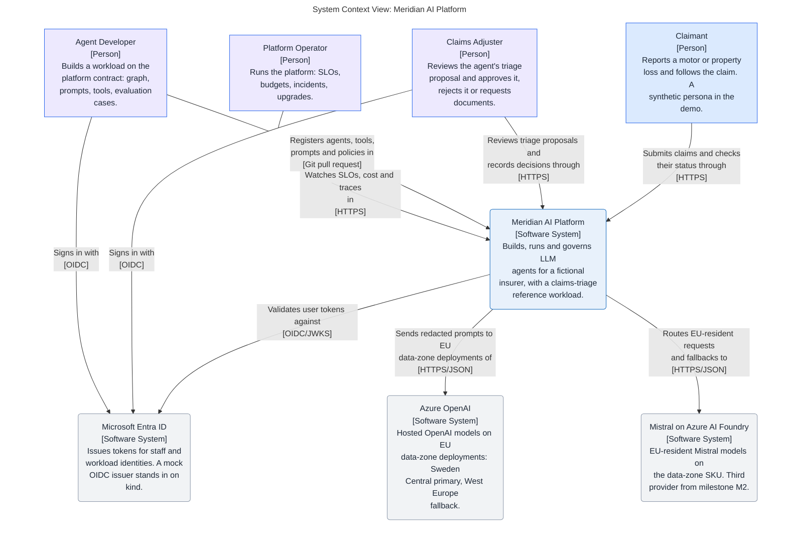

# Meridian AI Platform

A production-grade enterprise platform for building, running and governing
LLM agents, with a claims-triage reference workload for a fictional insurer.
Built and operated by one person as a portfolio project, designed as if a
platform team had to keep it alive.

**Status on 2026-09-29: bootstrap.** The architecture model, the first three
decisions and the engineering harness exist. No service, chart or Terraform
module is implemented yet. Every capability below is labelled implemented,
simulated or designed; an unlabelled claim is a documentation defect.

## Architecture at a glance

This diagram is the model's SystemContext view, generated by
`make mermaid-views`, so it changes only when the model does.

<!-- mermaid-view: SystemContext -->


## What it does, and what is real today

| Capability | Label | Where |
|---|---|---|
| Architecture model: context, container, governance and two runtime views | Designed | `docs/architecture/` |
| Decisions: Azure and kind with AWS designed; LangGraph behind a framework-agnostic contract; a thin model gateway | Accepted | `docs/architecture/decisions/` |
| Engineering harness: reviewers, skills, hooks, permissions, documentation gate | Implemented | `.claude/`, `.agents/`, `.codex/`, `scripts/` |
| Model Gateway: provider and region per data class, fallback, quotas, budgets, cost, redaction, audit | Designed, M1 | ADR 3 |
| Agent Runtime with human approval on durable checkpoints | Designed, M1 | ADR 2 |
| MCP tool servers for policies, policy wording and claims | Designed, M1 | Architecture overview |
| Evaluation harness with a golden set and a CI gate | Designed, M1 | Architecture overview |
| Observability, SLOs, runbooks, game-day incident record | Designed, M2 and M3 | Milestones |
| Helm on kind, Terraform for an ephemeral Azure environment, signed images | Designed, M2 | ADR 1 |

## Milestones

| Milestone | Outcome | Exit criterion |
|---|---|---|
| M0 Bootstrap | Repository, harness, model, first ADRs, synthetic data generator, kind cluster with the observability stack | `make docs` and `make check` pass; the generator produces the golden set |
| M1 Claims triage on kind | Gateway, three MCP servers, retrieval, triage graph with approval, adjuster UI, evaluation harness | The fifteen-minute demo runs from a clean checkout with `make` |
| M2 Azure, identity, delivery | Terraform, AKS, Entra ID, hardened charts, CI/CD with SBOM, scanning, signing and a manual approval gate | Environment created, demo on AKS, environment removed, all recorded |
| M3 Reliability and operations | Load test, game day and incident record, restore drill, provider swap, supervisor and worker agents, read-only console | SLO thresholds measured; the incident record comes from a real timeline |
| M4 Optional | AWS mapping with validate-only Terraform, or a second-framework workload, or a GraphRAG spike | One item, if time allows |

The step-by-step version, with dependencies, demo checkpoints and status, is
the [plan](docs/meridian-plan.md).

## Layout

```text
.claude/            rules (vendored from ECC), skills, agents, hooks, settings
.agents/            byte-identical skill mirror for non-Claude agents
.codex/             Codex hooks, prompts, agent twins, config example
.github/workflows/  documentation gate; architecture PDF release
docs/
  README.md         documentation index
  architecture/     Structurizr model, views, ADRs, requirements; README.md is the front door
scripts/            documentation checker, PDF and Mermaid tooling, Codex agent generator
Makefile            validate, inspect, check, docs, view, export, mermaid, pdf
```

Planned, milestone by milestone: `src/platform/`, `src/workloads/`,
`config/registry/`, `api/`, `infra/`, `data/synthetic/`, `tests/`.

## Working in this repository

```bash
make docs     # documentation gate: twins, mirrors, links, indexes, ADRs, IDs
make check    # Structurizr validate + inspect with the pinned image (Docker)
make view     # browse the model at http://localhost:8080/workspace/1
make mermaid  # regenerate derived Mermaid blocks, render every fence (Docker)
make pdf      # the Documentation tab and every view as one PDF
```

Agent instructions are in [CLAUDE.md](CLAUDE.md) and its twin
[AGENTS.md](AGENTS.md). The harness (reviewers, skills, hooks, permissions)
is described there; it is assembled from the owner's
[ECC fork](https://github.com/Dezoxy/ECC) and the owner's architecture
authoring kit.

## Documentation

- [docs/README.md](docs/README.md): index.
- [docs/architecture/README.md](docs/architecture/README.md): model, view
  register, decisions, requirements.
