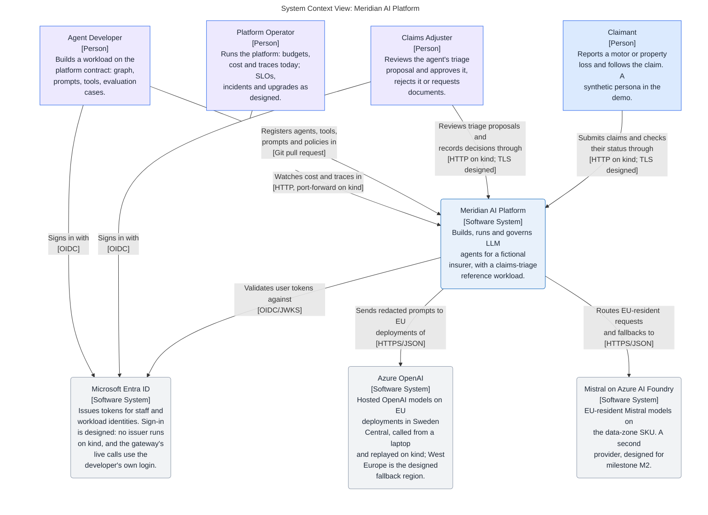

# Meridian AI Platform

A production-grade enterprise platform for building, running and governing
LLM agents, with a claims-triage reference workload for a fictional insurer.
Built and operated by one person as a portfolio project, designed as if a
platform team had to keep it alive.

**Status on 2026-10-04: milestone M1 is complete, on a laptop.** The
[fifteen-minute demo](docs/demo.md) runs from a fresh clone with `make`.
The architecture model, the
decisions, the engineering harness, a local platform on kind, the Azure
foundation, the platform registry and a walking skeleton of the Claims API,
the Agent Runtime and the Model Gateway exist; six services run on the
local kind cluster from one hardened Helm chart, under a default-deny
network policy, where `make demo` triages a synthetic claim (in
replay mode: the model and the embeddings are simulated), the gateway
routes a call to Azure
OpenAI by data class and residency from a laptop, falls back to a second
deployment in the same region when the first fails and holds each tenant
to its rate limits and budgets (a Grafana dashboard on kind shows its
tokens and cost per tenant, agent, model and provider), it answers
embedding requests under the
same controls (in replay mode, and against Azure from a laptop), three
MCP tool servers and the runtime's client for them run on kind, the
policy wordings are ingested into pgvector and
searched through one of those servers (with a simulated embedding), a
triage graph, a supervisor and four workers (S031, in tests), checks the
policy, retrieves the wording's terms and lets
rules decide each claim's route (a real model, `gpt-4o` on Azure OpenAI,
answered its one question for the first 40 golden claims from a laptop, and CI
replays those recorded answers through the gateway and grades them against
a reviewed baseline; on kind the model is still simulated), a claim
referred to an adjuster waits with its run paused in
PostgreSQL until the adjuster decides it on a server-rendered page and
the recorded decision resumes it, a scheduled sweep refers a claim whose
documents are overdue to an adjuster and cleans up what a failed request
left behind, the Agent Runtime, the Model Gateway and the three tool servers
serve mutual TLS on kind and refuse a caller the registry does not allow
(S055; the edge and the Claims API are still plain HTTP and no person signs
in), alert rules and a health dashboard are checked offline and applied
to the kind cluster, where `make smoke` reads them on every run, the
services' logs reach Loki on kind through a node agent (S064: implemented;
on kind, local only), the Agent Runtime, the tool servers, the Claims
Triage App and the sweep export metrics beside the gateway's, four rules
notice telemetry that stopped arriving (loaded on kind, not seen firing),
and seven runbooks exist (the certificate-expiry runbook's renewal procedure
was run on kind on 2026-10-06; the other six were not exercised), with
service level objectives nobody has measured, and no service runs in Azure
yet.
Every capability below is labelled implemented, simulated or designed;
an unlabelled claim is a documentation defect.

## Architecture at a glance

This diagram is the model's SystemContext view, generated by
`make mermaid-views`, so it changes only when the model does.

<!-- mermaid-view: SystemContext -->


## What it does, and what is real today

| Capability | Label | Where |
|---|---|---|
| Architecture model: context, container, governance and two runtime views, and deployment views of AWS, Google Cloud and Azure | Implemented as a model and compared with the code at the end of M1 (S018); what is not built yet is tagged `Designed` and drawn dotted. The AWS and the Google Cloud deployment views are designed only: no account or project exists on either cloud and nothing of them is deployed (S025, S077); a Terraform module for AWS exists as code that no account has seen (S036), and one for Google Cloud as code that no project has seen (S078; the Terraform rows below). The Azure deployment view is designed too: only the foundation exists in Azure, and the platform module for it is code that no plan has met (S020, ADR 11) | `docs/architecture/` |
| Decisions: Azure and kind with AWS designed; LangGraph behind a framework-agnostic contract; a thin model gateway; mutual TLS and cert-manager for a service's identity; an agent split into workers routed by code (ADR 5); a second agent framework behind the same host protocol (ADR 9, S037) | Accepted | `docs/architecture/decisions/` |
| Engineering harness: reviewers, skills, hooks, slash commands, an MCP server, permissions, documentation gate | Implemented. The command guard is a guard for habits and not a boundary: it answers `ask` before its own timeout, and the secret-rotation runbook lists what it does not see (S075). Since S036 it also knows the AWS module's commands: it denies a removal and a by-hand state change, and asks before a plan, an apply or an `aws` call that is not a read (implemented and tested against a case file; no AWS call has run). The hook that names a shell rewrite is built and prints nothing until the owner sets `bashEditDiffEnabled` in the user settings | `.claude/`, `.agents/`, `.codex/`, `.mcp.json`, `scripts/` |
| Python workspace and CI gates: ruff, pytest, import contracts that keep the agent framework out of platform packages, with a test that plants violations | Implemented | `pyproject.toml`, `tests/meridian/`, `.github/workflows/python.yml` |
| Synthetic data and golden set: policies, claim history, four policy wordings and 47 first-notice-of-loss claims with expected outcomes (56 policies, 51 history entries), from a seeded generator whose reruns are identical; the first 40 claims are unchanged and the last seven, from a second random stream (S067), are ones the model is not asked about: each fraud indicator at its boundary and just off it, and a policy number no policy has | Implemented | `data/synthetic/` |
| Security and quality registers: threat model with T-IDs per trust boundary, data classification, quality attributes with initial targets | Implemented as registers. The threat model is version 1 (S018), with 115 threats since S019, S032, S039, S024, S055, S056, S066, S037, S036, S068, S079, S020 and S021 (designed): each row's status was compared with the plan's steps and the code for version 1, and each control is labelled in its row. The quality attributes' targets are designed: none is measured before M3 | `docs/architecture/security/`, `docs/architecture/requirements/` |
| Agent framework spike: one claim flow with an approval pause in Microsoft Agent Framework and in LangGraph under one test suite, and the decision matrix in ADR 2; a second spike (S037) probed the framework at the pinned version for what a host needs (a pause, a resume in a new process, a store, a failed save, a step bound, events and spans: 79 tests, ADR 9) | Implemented as spikes, never deployed | `spikes/` |
| GraphRAG spike: a small knowledge graph of customer, policy, asset, claim and wording clause from the synthetic data, compared with the platform's hybrid search (simulated embedding) and with the triage's own lookup, under a decision rule written before the comparison. The rule's outcome is no: retrieval over a graph gets no step | Implemented as a spike, never deployed | `spikes/s038-graphrag/` |
| Local platform on kind: a Gateway API edge (Envoy Gateway), PostgreSQL 17 with pgvector (CloudNativePG), OpenTelemetry Collector, Prometheus, Grafana, Tempo and Loki from pinned Helm charts whose images run by digest, with Grafana's rights confined to its namespace; since S063 the `cert-manager` and `observability` namespaces have NetworkPolicies and Pod Security labels, only Meridian's pods push to the collector, over TLS, kube-state-metrics reads no Secret, and the database's and cert-manager's pods reach the API server's address alone; since S064 a log agent (a second release of the collector's chart, a DaemonSet in the namespace `logging`) ships the six services' and the sweep's output to Loki; `make up`, `make smoke`, `make cluster-holder`, `make down`; since S075 the cluster records which step holds it and the state of its last run, and `make up`, `make deploy` and `make down` stop for another holder unless `TAKE_CLUSTER=1` (a notice, not a lock); since S073, first half, `make deploy` applies the alert rules, `make cert-renew CERT=<name>` asks cert-manager to issue one Certificate again now, the scripts' `kubectl` and Helm calls are bounded, the services' restarts at a certificate renewal are spread across their margin, the rate store's probes leave no process behind, and `make smoke` tells a by-hand sweep Job from the schedule's, compares the alert rules' expressions, reads every service's network policy object and judges the database's own certificates (the second half, among it a frozen API server, a renewal seen end to end and a cold install that fails, is open) | Implemented, local only (a kind cluster on a laptop, and on 2026-10-06 one made from nothing on a Linux virtual machine: `make up` from no cluster ended with every release installed, `make smoke` printed 24 lines, 17 PASS and 7 SKIP, after it alone and 35 PASS after `make deploy` and `make demo`; the same day, made from nothing again with S063 in place: 28 lines after `make up` alone, 21 PASS and 7 SKIP, and 40 after `make deploy`, 39 PASS and one SKIP while the sweep's first run was still ahead; with S064, on the running cluster that day, `make smoke` printed 41 PASS, 41 PASS and, at the final tip, 44 PASS, with no FAIL and no SKIP, and the log agent ran as user 10001 and shipped the services' lines to Loki; and on 2026-10-07, with S073's first half on that cluster, 45 PASS and, with the line for the database's certificates (earliest: 89 days left), 46 PASS, with no FAIL and no SKIP (33 lines after `make up` alone is counted from the script, not seen); that day the rate store's probes were seen to leave no process behind, and `make cert-renew` renewed one healthy Certificate; not seen: a frozen API server against the bounds, a renewal with the restarts spread, `make cert-renew` after a denied request) | `infra/kind/` |
| Azure foundation: Terraform with its state in Azure Storage (Entra ID only), a 60-euro monthly budget with alerts at 50, 80 and 100 %, Key Vault, and Azure OpenAI `gpt-4o`, deployed twice as the gateway's two chat candidates, and `text-embedding-3-large` on regional deployments in Sweden Central with key authentication disabled; the West Europe fallback waits for the subscription's upgrade to pay-as-you-go | Implemented, persistent in a free-trial subscription of its own | `infra/terraform/` |
| Platform registry: models, providers, tools, agents, routing policies, tenants and services in YAML, with JSON Schemas generated from Pydantic models; `meridian registry validate` checks references, residency labels against SKU and region, personal data on EU labels only, idempotency keys on mutating tools, no decision tool in an allowlist, an agent's workers (S031: each with a tool list that is a subset of the agent's, the lists together the agent's; declared and checked here, enforced at run time by the runtime's tool client and the tool servers, see the rows below), and the Azure deployments against Terraform's outputs, locally and in CI, and prints a note, refusing nothing, for a graph agent the Agent Runtime may name and no tenant lists (S076); `meridian registry schemas` answers a directory it cannot update with one error line | Implemented; the gateway and the runtime load it at startup | `config/registry/`, `src/meridian/platform/registry/` |
| Walking skeleton: a claim posted to the Claims API starts a LangGraph run in the Agent Runtime, which calls the Model Gateway; the triage proposal is stored and one trace spans the services; a schema and a role per service with an insert-only audit table, whose rows carry a number the database stamps so that the events of one transaction can be ordered (S065, migrations 0017 and 0019: in tests, and applied to the kind cluster's database on 2026-10-06, where `make smoke` named 0019 the newest; the number's use is tested, not seen there; since S068 a row can leave only through one function of the upkeep role, migrations 0027 and 0028, tested against PostgreSQL and not run on a cluster, with no retention period set and nothing scheduled) | Implemented in tests and on kind (S041, S044; local only, `make demo` passed on 2026-10-06 on a Linux virtual machine too): one image runs the six services, the Claims API answers at `claims.meridian.localhost:8088`, and `make demo` posts a synthetic claim and finds its one trace across the Claims API, the runtime, the policy and knowledge tool servers and the gateway, and when the claim is referred to an adjuster, posts the decision (`DECISION`, approve by default) and finds that trace across the Claims API, the runtime and the claims tool server (S015); the gateway's replay provider is simulated | `src/meridian/`, `tests/meridian/test_walking_skeleton.py`, `Dockerfile`, `infra/helm/meridian/` |
| Model Gateway: provider and region per data class, fallback, quotas, budgets, cost, redaction, audit | Implemented in part: routing by data class and residency label, an Azure OpenAI adapter, an audited refusal and an audit record per call with the deployment's SKU, region and label (S010); a walk over the route's allowed candidates under one deadline, with a circuit breaker per deployment and an audit record per attempt, over two deployments in one region (S042). Per tenant, two rate windows, a daily token budget and a monthly cost quota, with the cost of each attempt reserved in a ledger before the provider is called; a call ID on every record of a call; tokens, cost and calls as OpenTelemetry metrics (S011), shown per tenant, agent, model and provider on a Grafana dashboard provisioned from `infra/kind/dashboards/` (S043, local only; cost reads 0 there because the simulated provider is priced at zero). An embeddings endpoint under the same controls: the registry fixes each embedding deployment's vector length and refuses a route whose candidates differ in model or length, and a provider's answer with the wrong count or length is refused; the Azure embedding call is proven against a mocked transport (S045) and ran live from a laptop on 2026-10-03 (`make gateway-live`, vectors of 1,024 dimensions). Live calls run from a laptop with the developer's Azure login (`make gateway-live`); on kind the gateway answers in replay mode, simulated, and a replay embedding is a hashed bag of words that carries no meaning of the text. A reply is at most 1,024 tokens (S014). A request may raise its data class with a header, never lower it, and `special` is refused; every chat message and embedding input is redacted (e-mail addresses, checksum-valid IBANs, Luhn-valid card numbers, international phone numbers and, since S067, the Hungarian forms: national phone numbers, tax numbers, domestic account numbers and personal identification numbers on their own, a social security number and a tax identification number after their word; each only where its check digit or, for a phone number, the numbering plan holds, tested and not run on a cluster; not identity card, passport or licence numbers or vehicle plates, which have no check digit); the provider's content filter is told from an outage and answered 400 (S047); a refused prompt and a completion the provider produced and the filter withheld (billed, and a model's own refusal of a structured request is the same) are both that 400 with `X-Meridian-Refusal: content-filter`, and the withheld one also carries `X-Meridian-Completion: withheld` and three headers that name the deployment, so the assessment records its drafter (S069, in tests; not on a cluster, and no real withheld completion has been seen). A chat request may carry a response schema, in a closed and bounded subset: only an agent the registry declares may send one, a deployment that does not honour one is left out of the candidates, and the Azure adapter sends it as strict structured outputs; tried live from a laptop on 2026-10-03 (`make gateway-live`), and accepted and ignored in replay mode, simulated (S051). A request over its tenant's rate windows is refused before its text is redacted; a provider's token counts are bounded against the request before the ledger takes them; an embedding input of more than 8,191 UTF-8 bytes is refused, since the gateway has no tokenizer and a token is at least one byte; the audit record of a refusal for policy or for a tenant limit says whether a chat or an embedding call was refused, and the count of such a flood's last minute is written once it has been quiet for two (S058), and the same for a caller the identity check refuses, under a key of its own (S069, in tests; not on a cluster). Ledger upkeep (S066): `meridian gateway` closes a reservation that a dead gateway process left open (kept, or released for a call known not to be billed), credits a tenant's counter of the current period and removes whole past months, as the database role `gateway_upkeep`, which can write no table: since S068 five database functions hold the rules and write the audit row in the transaction of the change (the close, the credit, the ledger's expiry in batches of 100 to 10,000 usage rows, the audit table's expiry in batches, and its count, which the dry run prints). `meridian gateway expire-audit` removes audit rows older than a cutoff the operator types; no retention period is set anywhere and nothing is scheduled (S068, implemented and tested against PostgreSQL, not run on a cluster). Implemented and tested against PostgreSQL, and seen on kind on 2026-10-06 (local only) as `make gateway-upkeep`, a Job of its own under the role's Secret: the read of the open reservations, a refusal that failed the Job (`GU304`, of the single call that S068 replaced with batches, which no run on kind has seen) and a credit of one token; the audit row of that credit was not read on the cluster. On Azure, giving it a credential is designed. Shared rate windows (S066, T-45): the two windows live in one Redis that every gateway process counts in, on the store's own clock, so two pods in a rolling update do not each allow the full limits; a gateway given the store's address (over TLS 1.3, with a client certificate and an access-control user limited to the keys `meridian:rate:*` and the commands its connection and script send; that is not "the script and nothing else": the user can run the script's five commands directly on any tenant's key, so whoever holds its password can read, fill, empty or freeze any tenant's windows, load a script that never ends and fill the store's memory until its pod is killed, and can never touch the ledger; a second user with no password and only `PING` lets the pod's probes restart a frozen store) refuses a call it cannot count with a 503 and never falls back to windows of its own, and the chart allows a second gateway replica only with the store on. On kind `make up` makes the store's Secret and the Meridian chart runs the store, with the gateway at one replica; implemented and tested (the access-control file, the probes and the TLS settings also ran against the pinned Redis image outside a cluster), and seen on kind on 2026-10-06 (local only) in three runs, the third a cold cycle on the step's final commit with one retry for a chart that could not be downloaded in time: `make up`, `make deploy`, `make smoke` (45 PASS, among them the line that proves the store's ingress rule) and `make demo` passed, the probe user's `PING` returned `PONG`, and a real renewal of the store's certificate was followed about 100 seconds later by one restart of the store. The 503 from the gateway for a store that is down was seen on kind on 2026-10-07 (S073, run R11). Tested without a cluster and not seen on one: the alert `MeridianRateStoreRefusing` firing, a second gateway replica, a rotation of the store's password and a store frozen by a script and restarted by its probe. Designed: a fallback region (after the subscription's upgrade) | ADR 3, `src/meridian/platform/gateway/` |
| Agent Runtime with human approval on durable checkpoints | Implemented in part (S015), in tests and on kind (local only): a run starts, pauses and is resumed once by a second request that names its tenant and reference, with its state in PostgreSQL tables only the runtime's role may read or write (LangGraph's own saver, in strict msgpack mode) and deleted when the run ends; a resumed leg that fails leaves the run paused, so the same decision can be sent again; a run is held to four model calls and sixteen tool calls per leg (S014); an agent that declares workers calls tools only through the view of one worker, which refuses a tool off that worker's list and counts against the same sixteen (S031, in tests; not run on a cluster). The claims triage graph is a supervisor and four workers (`intake`, `terms`, `assessor`, `approvals`), each worker a compiled subgraph with the tool list the registry gives it: fixed code and the rules route, no model chooses a worker, the supervisor holds no tool client and no model client, and the assessor gets the model client and no tool; the pause and the work after it share one node so that a failed resumed leg still leaves the run paused. Implemented in tests and in the replayed evaluation, whose only change is the `tools` fingerprint (S031; not run on a cluster since the change). A restart between the pause and the decision loses nothing. A scheduled sweep ends a run left running or paused that no claim keeps, as `Failed` with the audit reason `abandoned`, and removes the checkpoints a failed delete left (S052, in tests and on kind). The runtime serves mutual TLS and refuses a caller the registry does not allow (S055, the service identity row below). A leg writes its end over a run that is still `Running` and still carries the `updated_at` its own start or resume wrote, so a leg that outlives its lease overwrites neither what the sweep wrote nor what the leg that took the run over writes, and the text columns of `runtime.runs` are bounded at 64 characters (S059, and S069 for the claim: the cases that make a leg outlive its lease are in tests; the S059 code ran in the image deployed to the kind cluster on 2026-10-06, whose `make demo` passed, the claim has not run on a cluster; the tool servers still bind an outlived leg's calls until it ends). A resume delivers no value: its `input` must be `{}` and a workload reads the decision from its own record (S069, in tests). A leg that outlived its lease answers the stored status with no output and forgets no checkpoint unless its own end was recorded. The runtime's call to the gateway is bounded by phase (5 s for a pooled connection, 5 s to connect, 10 s to write, 30 s to read) and by a deadline of 30 s for the whole call, its reply is read to 1 MiB at most, counted after decoding, and a leg of four model calls and sixteen tool calls is held under 400 s, which is not provably under the 600 s lease while a gateway's headers can trickle (S069, in tests; not on a cluster). The runtime hosts two agent frameworks behind one `Host` protocol, picked for each agent by the registry's `host` field (S037): `LangGraphHost` for the triage and `AgentFrameworkHost` (Microsoft Agent Framework, its checkpoints in the runtime's own PostgreSQL table, JSON only) for the second workload, `claim-brief`; a start refuses an entry point that its host does not run. Implemented and tested through the real runtime, the three tool servers and a stub model, and seen on kind once on 2026-10-06 under replay (no model was called): migrations 0023 and 0024 applied by the migrate Job, a brief started, read, approved and filed for one claim and rejected for another, and the run meter split by agent; not seen on a cluster: a failed brief run, a resume refused for a changed workflow, the sweep closing a brief, a live model, a second runtime replica | ADR 2, `src/meridian/runtime/` |
| MCP tool servers for policies, policy wording and claims | Implemented in part (S013, S046), and running on kind (S044, local only): a Policy MCP server (policy lookup, and a claim history of the seeded entries and, since S053, the platform's own approved and rejected claims and, since S067, those still open and never a withdrawn one, each read through a view of its own), a Claims MCP server (claim notes, approval requests, the outcome recorded for a request) and a Knowledge MCP server (`wording_search` over the wording of the claim's own policy) on the official MCP SDK, and the runtime's tool client. A call is bound to its run's own claim, its policy or that policy's product, checked against the agent's allowlist and the registry's schemas on both sides (for an agent with workers, also against the list of the worker the call names, which the server accepts only as a worker of the run row's agent; S031, in tests; not run on a cluster), and audited in the transaction of its write; a write happens once per idempotency key. The policy store behind the policy server is simulated: tables seeded from the synthetic data. The knowledge server gets the query's vector from the Model Gateway under the run's tenant and agent; that embedding is simulated (replay mode only). On kind each server runs under its own database role, is reached by the runtime at its cluster name and answers only for that Host name; `make smoke` calls each through the runtime's client (a call for a run that does not exist, which every server refuses). The triage graph calls the three read tools (S014), and for a claim referred to an adjuster the two write tools and `approval_outcome`, which reads the decision the Claims API recorded for the run (S015). A network policy admits only the runtime's pods (S019), and a server serves mutual TLS and answers only the Agent Runtime's certificate (S055, the service identity row below). The runtime keeps one HTTP client for each tool server and sends with each call the time it will still wait; a server bounds that by its own ten seconds, and a call that gets none of its eight slots in that time, or is late before its work or its commit, fails as `timed-out` and is rolled back, the calls ended without running audited once per tenant, tool and window; a search already at the gateway is still charged (S059, T-62; in tests, and the kept client has met the tool server pods on kind since: `make demo` passed on 2026-10-06 with spans from all three; the `timed-out` paths were not seen there) | `src/meridian/platform/toolserver/`, `src/meridian/platform/policy_mcp/`, `src/meridian/platform/knowledge_mcp/`, `src/meridian/workloads/claims_triage/mcp_server/`, `src/meridian/runtime/tool_client.py`, `api/mcp/` |
| Knowledge store and retrieval: the four policy wordings as 85 clause chunks with their vectors in PostgreSQL (pgvector), and a hybrid search over one product and wording version | Implemented in part (S012), and on kind (S044, local only), where `make deploy` ingests the wordings once per image: `meridian knowledge ingest` checks each wording against the generator's manifest, asks the Model Gateway for the embeddings as the job agent `knowledge-ingestion` and replaces the store in one transaction, and the same Job then runs `meridian knowledge verify`, which compares each stored clause with the manifest-verified wordings and fails the Job on a difference (S067, migration 0026; tested, not run on a cluster; it finds a change only when it is run); the search fuses a keyword half (PostgreSQL full-text) and a vector half (exact cosine distance) by reciprocal rank, and refuses a store whose vectors another deployment made. The embedding is simulated: only the gateway's replay mode has run, a hashed bag of words, so the retrieval check's numbers say what word overlap finds, not what a model would. The knowledge tool server gives an agent the search (S046, the row above), bound to the product and wording version of the claim's own policy; each returned clause says whether it shares a term with the query, and a threshold for "no sufficient match" is designed, because none can be set against a simulated embedding | `src/meridian/platform/knowledge_mcp/`, `src/meridian/platform/migrations/0005_knowledge.sql`, `src/meridian/platform/migrations/0006_knowledge_server.sql`, `tests/meridian/knowledge_mcp/` |
| Claims triage: a graph checks the policy, loads its claim history, retrieves the wording's terms, asks the model whether an exclusion applies and proposes a route with citations | Implemented in part (S014); on kind since S044 (local only, replay mode). The graph's own code calls the three read tools in a fixed order, with search queries built from the claim's peril, never from claimant text. Rules decide the route: an automatic approval up to EUR 2,500 payable; an adjuster above it, for any fraud indicator, any exclusion or a policy not in force; a request for missing documents. A missing or uncertain fact can only stop an automatic approval: a clause the search did not return, exclusion clauses fewer than the wording has, a truncated claim history. The model answers one question, asked for by schema (S051) and still read strictly as JSON, and an answer that cannot be trusted sends the claim to an adjuster with the word that says why. A run that fails names its reason in the log and in its audit row. With a scripted model all 47 golden claims get the expected outcome (but for CLM-0012's recommendation, withheld from the model by the special-category screen); with the gateway's replay text, which is simulated and is no answer, the 15 claims that need the model go to a person and eight are approved by the rules alone (S067 added three of them, and the golden set's seven new claims need no model). No real model has answered the question in a triage run; the assessment's own call was answered live once, for a synthetic description (S051, `make gateway-live`). The Claims API keeps each claim in a state of the lifecycle (S015): the rules' automatic approval completes, a claim referred to an adjuster waits with its run paused until `POST /claims/{id}/decision` records the decision (approve, reject or request documents) with its audit event and resumes the run, and a claim whose triage failed can be posted again. Who decided is not known until the sign-in (S021); nothing is paid. An adjuster sends a claim back to triage, which ends its paused run; a claim whose triage failed is decided by an adjuster with no run; a claim is withdrawn, or the documents asked for are reported by name (metadata only), which triages it again; a claim is triaged at most five times, and documents that arrive after that refer it to an adjuster (S048, JSON routes until the claimant's pages, S049). The documents' deadline is the scheduled sweep's (S052, its row below); the claimant's pages take the report date the API stamps, and a decided claim enters the claim history (S053), as does a claim that is still open, never a withdrawn one (S067, migration 0025; tested, not run on a cluster). Three routes of the claim brief, the second workload (S037), start a brief of a claim, record an adjuster's decision on it and read it (`POST /claims/{id}/brief`, `POST /claims/{id}/brief/decision`, `GET /claims/{id}/brief`; migration 0024, the sweep keeps a paused brief's run): implemented and tested against a stubbed runtime, and seen on kind once on 2026-10-06 under replay (below), and the second workload that answers them, `claim-brief` on Microsoft Agent Framework (S037), is registered: it gathers the policy and the claim history with two read tools, asks the model once for a brief in plain text, pauses for an adjuster's decision and, on approve, files one fixed claim note; it decides nothing about the claim and never moves its state, and the Claims API redacts the brief's text (e-mail addresses, IBANs, card and phone numbers) before it stores or shows it. A brief runs in tests from its start through the pause to a filed note, beside a triage of the same claim, through the real runtime, the tool servers and a stub model; it has no evaluation grader (its golden set is empty). On kind on 2026-10-06, under replay (no model was called, so the brief is the replay's fixed sentence), a brief was started, read, approved and filed for one claim and rejected for another, the adjuster's page showed one `brief.decided` each, `meridian_runtime_runs_total` was split by agent, and the logs Loki holds had no brief text; not seen: a brief whose run fails, a changed-workflow refusal, the sweep closing a brief, a live model, a second replica, the brief's trace in Tempo. Before the model call (S047): the run's copy of the description has the claimant's name and e-mail replaced (the name also with a Hungarian case ending when the text writes it with a capital, and without its accents; since S067), and a description holding special-category data or addressing the model is not sent: the claim goes to an adjuster, as it does when the provider's content filter refuses the call; since S067 the injection screen also reads the description as it was posted, before the name is replaced, and the run is handed one boolean for it (a claimant's name made of screened words no longer hides them; a name made of the words an exclusion turns on still turns each into `[name]` in the copy, S070); a wording pair that the table of exclusion counts does not know fails the run with the code `wording-version-unknown` instead of sending the claim to a person unverified, where the rules would read the count (S067); the screens are word lists, a heuristic: S032 measured the injection screen on its own cases (26 of 66 attacks stopped since S067, 24 before it; 16 of 22 look-alike sentences flagged; the injection suite's row has the rest), and nothing measures the special-category screen | `src/meridian/workloads/claims_triage/`, `src/meridian/platform/migrations/0007_triage_proposal.sql`, `tests/meridian/test_triage_stack.py` |
| Claimant pages: a claim submitted from a form, its status in the claimant's words, the documents asked for reported and the claim withdrawn | Implemented (S049), in tests and on kind (local only; on 2026-10-06 `make smoke` read the start page there, and nothing else of the pages was run on the Linux virtual machine): server-rendered under `/claimant/` with no script, through the code of the JSON routes, every post another site makes refused; the form has no report date, the API stamps it (S053, T-66), and a refusal the routes share (422, 404, 405, 413, 400) is a page too; the status page reads only the documents a proposal asked for, never the reason, an amount or the model's text (T-65); the form asks for fictional data (T-04). No sign-in until S021: anyone who reaches the pages reads a claim's status by its ID | `src/meridian/workloads/claims_triage/claimant.py` |
| Adjuster UI: a queue of the claims that wait for a person, a claim's proposal with its citations, fraud indicators and audit trail, and the decision recorded from the page | Implemented (S016), in tests and on kind (local only; on 2026-10-06 `make smoke` read the queue page and had a post from another origin refused there, and nothing else of the pages was run on the Linux virtual machine): server-rendered with no script, the decision through the same code as the JSON route, a post another site makes refused, the audit trail read through one view of the audit table; a claim sent back to triage, or a claim whose triage failed decided or triaged again, from the page (S048); the trail shows each event's reason, and the page says when a claim's documents did not arrive in time (S052). Since S070 (tested against PostgreSQL, not run on a cluster) the claim page says beside a recommendation whether it rests on a model's reading of the exclusion clauses or on the rules alone, and the queue marks it in a column (an automatic approval never waits for an adjuster, so the mark does not reach it); the page labels the loss date and the report date as not checked and shows two gaps in days. Designed: the sign-in and the adjuster role (S021, T-69) | `src/meridian/workloads/claims_triage/adjuster.py` |
| Scheduled sweep: a claim whose documents are overdue goes to an adjuster, a claim a failed request stranded becomes one an adjuster sees, a run nobody will resume ends and no finished run keeps a checkpoint | Implemented (S052), in tests and on kind (local only; on 2026-10-06 its first scheduled pass on a cluster made from nothing finished and `make smoke` said so): a CronJob every five minutes with a database role of its own, which reads no claim text and which a trigger keeps from deciding or reopening a claim; the deadline is 14 days from the latest request for documents, and no claim is rejected without a person (C-02); it makes no model call and no tool call. Its two confining triggers fire for its own role alone, and it lists the leftover checkpoint threads by walking an index from a random start, a bounded read whatever the tables hold (S065: migration 0018, which narrows the two triggers, was applied to the kind cluster's database on 2026-10-06 and the sweep's pass of that image finished; that the triggers confine the role and that the listing starts at random is tested, not seen there) | `src/meridian/workloads/claims_triage/sweep.py`, `src/meridian/runtime/sweep.py`, `infra/helm/meridian/templates/sweep.yaml` |
| Evaluation harness with a golden set and a CI gate | Implemented (S017, S050), in tests and CI: the 47 golden claims run through the real services in one process, answered through the Model Gateway from a recording of a real model (`gpt-4o`, recorded once from Azure OpenAI on a laptop with `make eval-record`, for the first 40 claims: it holds 27 answers, the model is asked about 14 claims, and the seven claims S067 added are decided by the rules alone, so the recording was not made again; the baseline is 45 of 47 on `recommendation` and 47 of 47 on every other grader; a changed prompt finds no recording and fails the gate until it is recorded again); rule graders compare each proposal with the oracle (route, reason, recommendation, amount, fraud indicators, missing documents, the exclusion's clause, citations) and check QA-06's human oversight, and `meridian eval compare` fails the build on a grade that regressed, a broken absolute rule, or a prompt, judge prompt, recording, tool contract or golden set that changed without a reviewed new baseline. An LLM judge under an agent identity of its own grades groundedness only and changes no rule grade; each claim's model cost comes from the gateway's ledger, and each run's tool calls are kept with its grades; `meridian eval diff` puts two reports side by side (two prompt versions, run live: `data/evaluation/prompt-comparison.md`); `meridian eval run` posts the golden set to a deployed stack over HTTP and grades the ten rules (on kind on 2026-10-04: five claims, the model simulated there). Simulated in every evaluation run, the recording run included: the embeddings, and so the wording search. Latency is measured in the one live run only | `data/evaluation/`, `src/meridian/platform/evaluation/`, `src/meridian/platform/gateway/providers/recorded.py`, `src/meridian/workloads/claims_triage/evaluation.py` |
| Injection evaluation suite | Implemented (S032), in tests and CI, with a simulated model: 94 synthetic cases from the generator (54 attacks in a claimant's description, 12 in a stored exclusion clause, 24 benign look-alikes and, since S061, four plain wording sentences in a clause of a claim no exclusion applies to, none of them flagged) run through the real services in one process, answered by a script that obeys every injection, so the report measures the injection screen exactly and what a fully steered model could still change; six graders per case, three of them absolute, and `meridian eval compare` fails the build on a case the screen caught in the committed baseline and misses now, and on a screen whose patterns or normalisation differ from the baseline's (a sixth fingerprint, S061). First measured on 2026-10-04: 24 of 66 attacks stopped before the model (36 %); since S067 (2026-10-06, the baseline as it stands) 26 of 66 (39 %, against QA-09's 90 %: the two attacks in a claimant's name are stopped, because the screen also reads the description as posted), 16 of 22 look-alike sentences flagged, and no approval over the limit and no tool outside the allowlist in any case. Not measured: what a real model does with an injection it is shown | `data/synthetic/injection/`, `data/evaluation/injection-summary.md`, `src/meridian/workloads/claims_triage/injection.py`, `tests/meridian/test_injection_stack.py` |
| Workload scaffold: `meridian workload new NAME` writes a new workload into this repository's own package | Implemented (S039), in tests only: the command generates a package under `src/meridian/workloads/` with a graph of one node that calls no model and no tool, an evaluation plugin with no grader, a golden set with no case, four tests, the two entry points in `pyproject.toml`, one agent in the registry and, since S061, that agent in the Agent Runtime's entry in `services.yaml`. A test installs a copy of the tree, runs the command there and passes `meridian registry validate`, the import contracts, `ruff`, both trusted entry-point loaders, the generated tests and `meridian eval run --allow-empty`, which says that a golden set with no case evaluated nothing; without the flag such a run fails (T-82), and with or without it a golden set whose manifest names another workload is refused before a case is read (S061). The command declares and never grants (T-81): the agent lists no tool and no tenant lists it, so the runtime refuses its runs and the gateway its model calls; the one right it writes is the Agent Runtime's to name the agent in a call, which admits nothing before a tenant lists the agent (S061, the owner's decision of 2026-10-05); it takes one closed name pattern, names the line of a file it cannot use where the parser gives one and says what kinds of thing hold a taken name, writes over no file, edits three (`pyproject.toml`, `agents.yaml`, `services.yaml`), undoes a write that fails or is interrupted (it puts back every file that still holds its own edit, and leaves and names only a file the person saved since and any path it could not restore; two save windows stay open without a lock) and calls no API and no model (S076, tested in a copy of the tree, none of it run on a cluster). The agent has no worker: the command writes no second graph of subgraphs, workers are an edit a person makes in `agents.yaml`, and `meridian registry validate` prints a note for the new agent until a tenant lists it. Still by hand: a tenant that lists the agent, its tools and any workers, a prompt, synthetic cases from a seeded generator and their graders, an API, migrations and deployment, and the exact pin `NAMES` in `tests/meridian/registry/test_services.py`, which fails on the runtime's new `agents` entry until someone edits it on purpose. Not done: nothing generated has run through the Agent Runtime's run API or on kind, and no generated workload is committed. Since S037 the Agent Runtime's tests replace the graph of the agent under test alone and load every other agent through its real entry point, so they no longer assume one graph agent: in a tree the command had written into, the runtime's, the registry's and the scaffold's tests passed but for that one pin (2026-10-06, tested without a cluster) | `src/meridian/platform/cli/workload.py`, `src/meridian/platform/cli/scaffold.py`, `src/meridian/platform/cli/scaffold_writes.py`, `src/meridian/platform/cli/templates/workload/`, `tests/meridian/cli/` |
| SLOs, alerts and dashboards as code, runbooks, game-day incident record | Implemented in part, as a baseline (S024). Eight service level objectives, every target a proposal nobody has measured: five have an indicator the kind cluster's Prometheus can compute, two (triage latency, the gateway's overhead) are designed, because no service records a duration, and a third, triage completion, has counters since S064 (seen on kind on 2026-10-06) that no rule or dashboard reads. Eighteen alert rules (three of them, since S064, notice a metric series that is not there, a fourth a log agent that is not ready, since S066 one the Model Gateway's refusals for want of an answer from the rate store, and since S072 one the rate store's restart loop, implemented and unit-tested, not yet loaded on a cluster) in one `PrometheusRule` file with unit tests, which CI checks with Prometheus's own checker (`make alerts`). Two dashboards as code: the gateway's tokens and cost (S043, on kind, local only) and the platform's health. Eight runbooks (provider outage, budget exhaustion, database failure, rollback, secret rotation, certificate expiry, telemetry missing, rate store), written from the code: the renewal procedure of the certificate-expiry runbook was run on kind on 2026-10-06, and the other seven were not exercised, but for the budget-exhaustion runbook's `make gateway-upkeep` and the rate store runbook's ping as the `probe` user, which S066's runs ran there. `make up` applies the rules and the health dashboard (since S073 `make deploy` applies the rules too, seen on kind on 2026-10-07), and check 11 of `make smoke` loads and reads them on every run (five groups and all 19 rules of S064's tree loaded since S064, and all 20 rules in S066's third run, S066's alert among them; every rule healthy, no Meridian alert firing, the dashboard served with queries that run in Prometheus: seen on the cluster on 2026-10-06, local only); one alert, `MeridianCertificateNotRenewed`, was seen pending, firing and resolved on kind in that renewal watch, and none of S064's four, S066's `MeridianRateStoreRefusing` nor S072's `MeridianRateStoreRestartLoop` was seen firing (tested without a cluster). Whether each series a rule or a panel names exists, and whether a panel shows data, stays a hand check. Designed: alert routing and notification (kind runs no Alertmanager), thresholds from a load test (S027), the incident record from a game day (S028) | `docs/operations/`, `infra/kind/alerts/`, `infra/kind/dashboards/` |
| Governance documents: a provider onboarding process with a checklist of 24 items and a service acceptance process with a checklist of 30, applied on paper to what the repository holds (the provider process once, the acceptance process twice) | Designed (S034, S037): written and applied on paper, to Azure OpenAI (8 items met, 11 partly met, 5 not met), to claims triage (9 met, 15 partly met, 6 not met, so the workload is not called accepted) and, as the second applied example of the acceptance process, to the claim brief (S037: 6 met, 15 partly met, 9 not met, from tests and one run on kind under replay, so it is not called accepted either); no tool or gate enforces them beyond the checks the documents name (`meridian registry validate`, the import contracts, the evaluation gate, the secret scan). Items that need a legal judgement are recorded as open | `docs/governance/` |
| A hardened Helm chart for the six services, the Jobs and the sweep: probes, memory limits, non-root pods with a read-only root filesystem, a pinned image reference, disruption budgets and a default-deny NetworkPolicy with one allow policy per workload | Implemented on kind (S019, local only): `make deploy` installs the release, and `make smoke` proves on every run that a path no rule allows is blocked. The policies admit pods by label, which is not identity (mutual TLS adds that: S055, the next row); each service runs one replica, so the budgets protect nothing yet; the edge has no TLS | `infra/helm/meridian/`, `infra/kind/README.md`, `tests/meridian/test_helm_chart.py` |
| Service identity: a service that is called learns which service calls it from a certificate, not from a header | Implemented (S055, S056), in tests and on kind (local only); nothing runs in Azure. cert-manager issues one certificate per workload from a CA of the cluster's own, and since S056 only for a request a policy allows: cert-manager's own approver is off, and its approver-policy lets the issuer sign a request made in the `meridian` namespace with one of the eight URIs under the Meridian prefix that the chart's Certificates ask for and no other (since S072 a list that a test holds equal to the chart's, implemented and not yet seen on the cluster; on the cluster, before it, a request from another namespace was denied); the Agent Runtime, the Model Gateway and the three tool servers serve TLS and read the caller's service ID from its certificate, and a caller checks the server's name. A call with no certificate is refused with 401 (the kubelet's health probe, `GET /healthz`, is the one exception); a service that `config/registry/services.yaml` does not hold or that may not call this service is refused with 403, and so is a tenant or an agent outside the caller's entry in that file; each refusal is audited. The tool servers answer the Agent Runtime only. A service loads its certificate once; inside the last 24 hours of the one it loaded it answers 503 on `/healthz` once the mounted file holds a renewed one, so the kubelet restarts it, and from the certificate's end it is unhealthy whatever the file holds (tested over real TLS, and seen on the cluster on 2026-10-06 with certificates of one hour: every service answered 503 ten minutes before the end of the certificate it had loaded and the kubelet restarted each container once, as the certificate-expiry runbook records); four alerts watch the certificates, and a key file is readable by the service's own user and group alone. `make smoke` proves 200, 401 and 403 against the gateway, reads the 403's reason in the audit table, presents a certificate of another CA, which passes only if the connection ends before the request is sent (a TLS alert, or a reset: a close after the request is a FAIL), reads that the policies stand and makes one request for the issuer from another namespace, which must be denied and is deleted (nine of its 46 PASS lines; seen on the cluster on 2026-10-06: the other CA's answer was a reset on every run and the alert was never seen, and the request was Denied by `policy.cert-manager.io` and deleted, none left in `default`). Not built: TLS at the edge and between the edge and the Claims API, which is a client only and serves plain HTTP inside the cluster (the plan's backlog, S020); sign-in for people (S021), so the tenant is still the calling service's word, bounded by its registry entry and not a person's; no revocation; inside `meridian` the policy does not tell one service's request from another's. Designed: the same on AKS, where the issuer and the policy change (ADR 4) | ADR 4, `config/registry/services.yaml`, `src/meridian/platform/common/identity.py`, `src/meridian/platform/common/certlife.py`, `infra/helm/meridian/templates/certificates.yaml`, `infra/kind/manifests/certificate-policy.yaml` |
| Terraform for an ephemeral Azure environment: a module for a network, an AKS cluster, a registry, a PostgreSQL server reached by private access, two workload identities, two private endpoints, an audit-log workspace and two budgets, and two `make azure-platform-*` commands that check it | Implemented as code (S020, first half), checked without an account (`terraform validate` and a policy scan that finds nothing at HIGH or CRITICAL) and **NEVER applied**: no plan was made against an account, nothing of it exists in Azure, and no command plans, applies or removes it yet. What waits: the wrapper and the guard's rules, the owner's upgrade to pay-as-you-go, a decision on a firewall for the foundation's vault, the apply and its cost, and the second half that deploys the chart into it | `infra/terraform/azure/`, ADR 11 |
| Signed images | Designed, M2 | ADR 1 |
| Terraform for AWS: a module for a network, an EKS cluster with one node group, an image repository, a PostgreSQL instance whose password RDS manages, a secret with a Pod Identity role and a budget, and five `make aws-*` commands around it | Implemented as code (S036, first half), checked without an account (`terraform validate` and a Trivy configuration scan) and never applied: no AWS account exists for a session and no credential is on the machine, so none of it has run in AWS. The script pins the account, applies only a saved plan and removes only from a terminal; the command guard denies the removal and by-hand state changes and asks before a plan or an apply. Designed: the one apply in the owner's account, asked at the paid stop of S079 after its cost is stated, which may be answered no | `infra/terraform/aws/`, `infra/terraform/aws.sh`, ADR 6 |
| Terraform for Google Cloud: a module for a network, a GKE Standard cluster, an image repository, a PostgreSQL instance reached by Private Service Connect, a secret with one workload identity binding and a budget, and two `make gcp-*` commands that check it | Implemented as code (S078), checked without a project (`terraform validate` and a Trivy configuration scan, which accepts nothing) and never planned and never applied: no project, billing account or credential exists, so none of it has run in Google Cloud, and the project pin in the module has never been seen to refuse. By decision no command plans, applies or removes it and the command guard is unchanged; the module's README says how the owner would apply it by hand, which nobody has done. No apply is planned: the owner's decision of 2026-10-06 is that this cloud is a scaffold ("gcp just scafold") | `infra/terraform/gcp/`, ADR 7 |

## Milestones

| Milestone | Outcome | Exit criterion |
|---|---|---|
| M0 Bootstrap | Repository, harness, model, first ADRs, synthetic data generator, kind cluster with the observability stack | `make docs` and `make check` pass; the generator produces the golden set |
| M1 Claims triage on kind | Gateway, three MCP servers, retrieval, triage graph with approval, adjuster UI, evaluation harness | The fifteen-minute demo runs from a clean checkout with `make` |
| M2 Azure, identity, delivery | Terraform, AKS, Entra ID, hardened charts, CI/CD with SBOM, scanning, signing and a manual approval gate | Environment created, demo on AKS, environment removed, all recorded |
| M3 Reliability and operations | Load test, game day and incident record, restore drill, provider swap, read-only console; the triage as a supervisor and workers is built (S031, ADR 5; in tests, not run on a cluster since) | SLO thresholds measured; the incident record comes from a real timeline |
| M4 Optional | AWS mapping with a Terraform module that is checked and then applied once in a real account (S025 and S036, the owner's decision of 2026-10-06; the mapping, the Azure platform document it maps from and a deployment view of AWS in the model are written, all designed; the module is written, as code checked without an account and never applied (S036's first half), and its one apply is designed: asked at the paid stop of S079, where it may be answered no; for Google Cloud, S077 and S078, the module is checked and never applied, the owner's decision of the same day: its mapping and its deployment view are written, designed, and its module is written too (S078), as code checked by `terraform validate` and an offline scan and never planned or applied, with no command that does either; a cluster whose control plane is not managed, to be applied once on AWS and a scaffold on Google Cloud, is S079: both modules are written, as code tested with stand-ins and never applied, and the AWS one's apply is designed, asked at the same paid stop), or a second-framework workload (built, S037: in tests, and seen on kind once under replay on 2026-10-06), or a GraphRAG spike (built, S038: its answer was no), or a workload scaffold command (built, S039) | One item was the limit; the owner lifted it for each of the four on 2026-10-06 and added Google Cloud beside AWS |

The step-by-step version, with dependencies, demo checkpoints and status, is
the [plan](docs/meridian-plan.md).

## Layout

```text
.claude/            rules (vendored from ECC), skills, agents, slash commands, hooks, settings
.agents/            byte-identical skill mirror for non-Claude agents
.codex/             Codex hooks, prompts, agent twins, config example
.mcp.json           the chrome-devtools MCP server, pinned
.github/workflows/  documentation gate; Python gates; architecture PDF release
.github/renovate.json  which pinned versions Renovate watches and how it groups them
api/mcp/            what each MCP tool server publishes, generated from the registry
config/registry/    platform registry: YAML, generated JSON Schemas, Terraform output snapshot
data/synthetic/     seeded generator, its committed output, the golden set and the injection cases
data/evaluation/    the evaluation baselines the CI gate compares each run's reports with
docs/
  README.md         documentation index
  demo.md           the fifteen-minute demo: what to run, show and say
  architecture/     Structurizr model, views, ADRs, requirements; README.md is the front door
  operations/       service level objectives (proposals), what the alert rules watch, seven runbooks
  governance/       provider onboarding and service acceptance: two designed processes, applied on paper (onboarding once, acceptance to claims triage and to the claim brief)
infra/kind/         local platform: pinned chart versions, values, Grafana dashboards, alert rules; up, deploy, demo, smoke and down scripts
infra/helm/         the Meridian chart: the six services, the Jobs, the sweep, their budgets and network policies
infra/terraform/    Azure foundation: Terraform root module, state bootstrap, plan, apply and smoke scripts; aws/ and aws.sh: the AWS module and its wrapper script, checked without an account and never applied (S036); gcp/: the Google Cloud module, checked by `make gcp-validate` and `make gcp-scan` and never planned or applied, with no script of its own (S078); azure/: the Azure platform module, checked by `make azure-platform-validate` and `make azure-platform-scan` and never planned or applied (S020); aws-kubeadm/: the AWS module for a self-managed cluster, checked by `make aws-kubeadm-validate` and `make aws-kubeadm-scan` and not planned or applied (S079); gcp-kubeadm/: its Google Cloud twin, checked by `make gcp-kubeadm-validate` and `make gcp-kubeadm-scan` and never planned or applied (S079)
scripts/            documentation checker, PDF and Mermaid tooling, Codex agent generator, the alert rules' extraction for promtool
spikes/             throwaway experiments (S005 and S037 uv projects of their own, S038 on the root environment); never deployed
src/meridian/       the one Python package (src layout)
  platform/         shared platform services (gateway, registry, migrations, the tool-server kit, the policy tool server, the knowledge store with its ingestion, search and tool server) and the meridian CLI; never import the agent framework
  runtime/          the Agent Runtime, which hosts LangGraph graphs and, since S037, Microsoft Agent Framework workflows (one host for each, picked by the registry; implemented, tested and seen on kind once under replay); between workloads and platform
  workloads/        use cases built on the platform contract: the Claims API, its triage graph, its claims tool server and the claim brief workflow (S037)
tests/              tests for the scripts and the bash guard
  meridian/         pytest tests for the package: import contracts, registry, services, tool servers, database, the walking skeleton, the Helm chart and the kind scripts, the workload scaffold
  synthetic/        pytest tests for the generator: reruns, labels, citations
pyproject.toml      uv project: Python 3.13, the meridian command, dev tools, ruff, pytest, import-linter
uv.lock             locked dependency versions
Dockerfile          one image for the six services, the migrations, the policy seed, the ingestion and the scheduled sweep; .dockerignore allowlists its context
Makefile            validate, inspect, check, docs, view, export, mermaid, pdf, lint, pytest, pytest-db, eval, registry, synthetic, up, deploy, images, demo, smoke, grafana, down, azure-*, aws-*, gcp-*
```

Planned, milestone by milestone: OpenAPI documents under `api/` and the
the deployment of the chart into the ephemeral Azure environment, whose
Terraform exists under `infra/terraform/azure/` (written, never applied).

## Working in this repository

```bash
make docs     # documentation gate: twins, mirrors, links, indexes, ADRs, IDs
make secret-scan  # scan the commits a push would add for secrets, as CI's secret scan does (needs gitleaks)
make check    # Structurizr validate + inspect with the pinned image (Docker)
make view     # browse the model at http://localhost:8080/workspace/1
make mermaid  # regenerate derived Mermaid blocks, render every fence (Docker)
make pdf      # the Documentation tab and every view as one PDF
make lint     # ruff, format check, import-linter contracts, file size check (needs uv)
make pytest   # package and generator tests, including the import-contract check, in parallel (PYTEST_WORKERS=0 for one process; needs uv)
make pytest-db  # the same with a throwaway PostgreSQL container (with pgvector), so the database tests run too (Docker)
make alerts   # check the alert rules with promtool from a pinned image and run their unit tests (Docker, uv)
make registry # validate the registry, its schemas and the tool-server contracts under api/mcp, against the Terraform output snapshot (needs uv)
make synthetic  # regenerate data/synthetic from its seed; a rerun changes nothing (needs uv)
make eval     # answer the golden set through the stack from the recorded model's answers, grade it with the rules and the judge, run the injection cases with a scripted model, and compare both reports with their baselines (Docker); make eval-baseline after a reviewed prompt, tool, recording, golden-set, screen or injection-case change; make eval-record records again from the live model (spends money, needs az login)
uv run meridian workload new NAME  # scaffold a workload into this checkout: a graph, an evaluation, an empty golden set, entry points, a registry agent with no tool and no tenant, and that agent in the Agent Runtime's entry in services.yaml; then make lint, make registry and the first-run commands it prints
uv run meridian gateway --help  # keep the gateway's ledger: list and close a reservation a dead process left, credit a tenant, expire old months, expire audit rows older than a cutoff you type (no period is set); reads MERIDIAN_GATEWAY_UPKEEP_DATABASE_URL, one audit row per change (tested against PostgreSQL, not run on a cluster)
make up       # the local platform on kind; safe to rerun (Docker, kind, kubectl, helm, jq)
make demo     # build the image, migrate, seed, deploy the six services, ingest the wordings, post a claim, find its trace in Tempo; decide it when it waits for an adjuster (DECISION=reject)
make smoke    # edge, pgvector, one call per tool server through the runtime's client, a test trace, log and metric read back through Grafana, the cost dashboard with the gateway's series, the adjuster's and claimant's pages, the scheduled sweep's last run, and the alert rules and the health dashboard
make images   # list the meridian:* images in the Docker engine and the kind node that no workload uses, and print the commands that would remove them; removes nothing (Docker, kubectl, jq)
make cert-renew CERT=<name>  # ask cert-manager to issue one Certificate of the namespace meridian again now, for after a denied or failed request when its own wait (an hour, doubling) would otherwise run; kind only, stops for another holder unless TAKE_CLUSTER=1 (kubectl, jq)
make grafana  # Grafana at http://127.0.0.1:3000; make grafana-password prints the password
make cluster-holder  # print which step holds the kind cluster, its commit, the time and the state of its last run (changing after a make up or make deploy that did not end well); a notice, not a lock (kubectl, kind)
make down     # delete the kind cluster; destructive, but disposable on the development machine (hard rule 8); stops when another step holds it unless TAKE_CLUSTER=1
make azure-state  # once: the Terraform state storage in Azure (creates Azure resources)
make azure-plan   # plan the Azure foundation into a saved plan file
make azure-apply  # apply exactly that saved plan (changes Azure; the owner confirms)
make azure-smoke  # the deployments as planned, keys off, one chat and one embedding call with Entra ID
make gateway-live # four real chat calls and one embedding call through the gateway in live mode on this laptop, one chat call with the first candidate made to fail and two with a response schema (az login, Docker)
make registry-snapshot  # refresh the registry's copy of Terraform's deployment outputs (read-only)
make aws-validate # fmt check, init with no backend and validate of the AWS module; needs no account and changes nothing in AWS (needs terraform)
make aws-scan     # Trivy's configuration scan of the AWS module from a pinned image, network off; changes nothing in AWS (Docker)
make aws-plan     # check the pinned account, then plan the AWS module into a saved plan file (the owner's sign-in; changes nothing in AWS)
make aws-apply    # apply exactly that saved plan: SPENDS MONEY; the owner runs it, from where no session holds credentials (S036's second half, not done)
make aws-destroy  # remove the AWS environment: Terraform asks its own question; the owner runs it, in a terminal (not done: nothing was applied)
make gcp-validate # fmt check, init with no backend and validate of the Google Cloud module; needs no project and no credential and changes nothing in Google Cloud (needs terraform)
make gcp-scan     # Trivy's configuration scan of the Google Cloud module from the pinned image, network off; changes nothing in Google Cloud (Docker); no command plans, applies or removes that module
make aws-kubeadm-validate # fmt check, init with no backend and validate of the AWS self-managed cluster module; needs no account and changes nothing in AWS (needs terraform)
make aws-kubeadm-scan     # Trivy's configuration scan of that module from the pinned image, offline; changes nothing in AWS (Docker); no `make` target plans, applies or removes it: `infra/terraform/aws.sh` does, by the owner's hand after the cost and a yes, from where no session holds credentials (S079, tested with stand-ins, never run)
make gcp-kubeadm-validate # fmt check, init with no backend and validate of the Google Cloud twin of the self-managed cluster module; needs no project and no credential and changes nothing in Google Cloud (needs terraform)
make gcp-kubeadm-scan     # Trivy's configuration scan of that twin from the pinned image, offline; changes nothing in Google Cloud (Docker); no command plans, applies or removes it
```

Agent instructions are in [CLAUDE.md](CLAUDE.md) and its twin
[AGENTS.md](AGENTS.md). The harness (reviewers, skills, hooks, permissions)
is described there; it is copied from the owner's development base, which
curates it from the owner's [ECC fork](https://github.com/Dezoxy/ECC) and
carries the architecture authoring kit.

## Documentation

- [docs/README.md](docs/README.md): index.
- [docs/demo.md](docs/demo.md): the fifteen-minute demo on a laptop.
- [docs/architecture/README.md](docs/architecture/README.md): model, view
  register, decisions, requirements.

## Licence

[Apache License 2.0](LICENSE), copyright 2026 Dezoxy. The rules, skills and
reviewer agents copied from ECC stay under their MIT licence;
[NOTICE](NOTICE) lists them.
