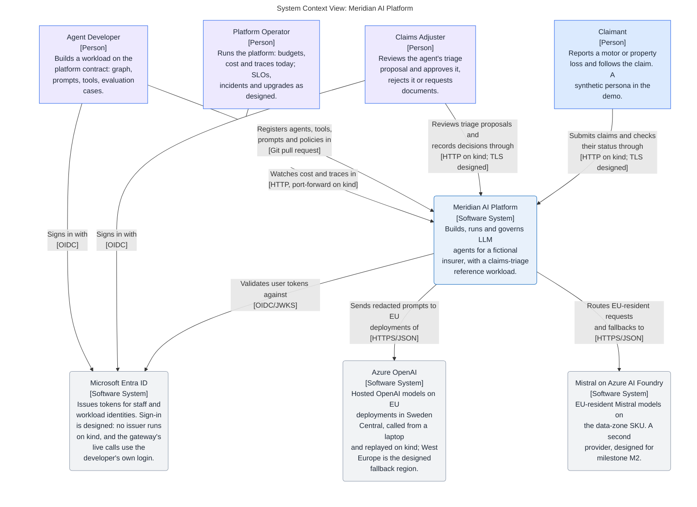

# Meridian AI Platform

A production-grade enterprise platform for building, running and governing
LLM agents, with a claims-triage reference workload for a fictional insurer.
Built and operated by one person as a portfolio project, designed as if a
platform team had to keep it alive.

**Status on 2026-10-04: milestone M1 is complete, on a laptop.** The
[fifteen-minute demo](docs/demo.md) runs from a fresh clone with `make`.
The architecture model, the first four
decisions, the engineering harness, a local platform on kind, the Azure
foundation, the platform registry and a walking skeleton of the Claims API,
the Agent Runtime and the Model Gateway exist; six services run on the
local kind cluster from one hardened Helm chart, under a default-deny
network policy, where `make demo` triages a synthetic claim (in
replay mode: the model and the embeddings are simulated), the gateway
routes a call to Azure
OpenAI by data class and residency from a laptop, falls back to a second
deployment in the same region when the first fails and holds each tenant
to its rate limits and budgets (a Grafana dashboard on kind shows its
tokens and cost per tenant, agent, model and provider), it answers
embedding requests under the
same controls (in replay mode, and against Azure from a laptop), three
MCP tool servers and the runtime's client for them run on kind, the
policy wordings are ingested into pgvector and
searched through one of those servers (with a simulated embedding), a
triage graph checks the policy, retrieves the wording's terms and lets
rules decide each claim's route (a real model, `gpt-4o` on Azure OpenAI,
answered its one question for the 40 golden claims from a laptop, and CI
replays those recorded answers through the gateway and grades them against
a reviewed baseline; on kind the model is still simulated), a claim
referred to an adjuster waits with its run paused in
PostgreSQL until the adjuster decides it on a server-rendered page and
the recorded decision resumes it, a scheduled sweep refers a claim whose
documents are overdue to an adjuster and cleans up what a failed request
left behind, the Agent Runtime, the Model Gateway and the three tool servers
serve mutual TLS on kind and refuse a caller the registry does not allow
(S055; the edge and the Claims API are still plain HTTP and no person signs
in), alert rules, a health dashboard and six runbooks exist as
files that were checked offline and are not yet applied to a cluster, with
service level objectives nobody has measured, and no service runs in Azure
yet.
Every capability below is labelled implemented, simulated or designed;
an unlabelled claim is a documentation defect.

## Architecture at a glance

This diagram is the model's SystemContext view, generated by
`make mermaid-views`, so it changes only when the model does.

<!-- mermaid-view: SystemContext -->


## What it does, and what is real today

| Capability | Label | Where |
|---|---|---|
| Architecture model: context, container, governance and two runtime views | Implemented as a model and compared with the code at the end of M1 (S018); what is not built yet is tagged `Designed` and drawn dotted | `docs/architecture/` |
| Decisions: Azure and kind with AWS designed; LangGraph behind a framework-agnostic contract; a thin model gateway; mutual TLS and cert-manager for a service's identity | Accepted | `docs/architecture/decisions/` |
| Engineering harness: reviewers, skills, hooks, slash commands, an MCP server, permissions, documentation gate | Implemented | `.claude/`, `.agents/`, `.codex/`, `.mcp.json`, `scripts/` |
| Python workspace and CI gates: ruff, pytest, import contracts that keep the agent framework out of platform packages, with a test that plants violations | Implemented | `pyproject.toml`, `tests/meridian/`, `.github/workflows/python.yml` |
| Synthetic data and golden set: policies, claim history, four policy wordings and 40 first-notice-of-loss claims with expected outcomes, from a seeded generator whose reruns are identical | Implemented | `data/synthetic/` |
| Security and quality registers: threat model with T-IDs per trust boundary, data classification, quality attributes with initial targets | Implemented as registers. The threat model is version 1 (S018), with 91 threats since S019, S032, S039, S024, S055 and S056: each row's status was compared with the plan's steps and the code for version 1, and each control is labelled in its row. The quality attributes' targets are designed: none is measured before M3 | `docs/architecture/security/`, `docs/architecture/requirements/` |
| Agent framework spike: one claim flow with an approval pause in Microsoft Agent Framework and in LangGraph under one test suite, and the decision matrix in ADR 2 | Implemented as a spike, never deployed | `spikes/` |
| GraphRAG spike: a small knowledge graph of customer, policy, asset, claim and wording clause from the synthetic data, compared with the platform's hybrid search (simulated embedding) and with the triage's own lookup, under a decision rule written before the comparison. The rule's outcome is no: retrieval over a graph gets no step | Implemented as a spike, never deployed | `spikes/s038-graphrag/` |
| Local platform on kind: a Gateway API edge (Envoy Gateway), PostgreSQL 17 with pgvector (CloudNativePG), OpenTelemetry Collector, Prometheus, Grafana, Tempo and Loki from pinned Helm charts, with Grafana's rights confined to its namespace; `make up`, `make smoke`, `make down` | Implemented, laptop only | `infra/kind/` |
| Azure foundation: Terraform with its state in Azure Storage (Entra ID only), a 60-euro monthly budget with alerts at 50, 80 and 100 %, Key Vault, and Azure OpenAI `gpt-4o`, deployed twice as the gateway's two chat candidates, and `text-embedding-3-large` on regional deployments in Sweden Central with key authentication disabled; the West Europe fallback waits for the subscription's upgrade to pay-as-you-go | Implemented, persistent in a free-trial subscription of its own | `infra/terraform/` |
| Platform registry: models, providers, tools, agents, routing policies, tenants and services in YAML, with JSON Schemas generated from Pydantic models; `meridian registry validate` checks references, residency labels against SKU and region, personal data on EU labels only, idempotency keys on mutating tools, no decision tool in an allowlist, and the Azure deployments against Terraform's outputs, locally and in CI | Implemented; the gateway and the runtime load it at startup | `config/registry/`, `src/meridian/platform/registry/` |
| Walking skeleton: a claim posted to the Claims API starts a LangGraph run in the Agent Runtime, which calls the Model Gateway; the triage proposal is stored and one trace spans the services; a schema and a role per service with an insert-only audit table, whose rows carry a number the database stamps so that the events of one transaction can be ordered (S065, migrations 0017 and 0019, in tests; not yet deployed to a cluster) | Implemented in tests and on kind (S041, S044; laptop only): one image runs the six services, the Claims API answers at `claims.meridian.localhost:8088`, and `make demo` posts a synthetic claim and finds its one trace across the Claims API, the runtime, the policy and knowledge tool servers and the gateway, and when the claim is referred to an adjuster, posts the decision (`DECISION`, approve by default) and finds that trace across the Claims API, the runtime and the claims tool server (S015); the gateway's replay provider is simulated | `src/meridian/`, `tests/meridian/test_walking_skeleton.py`, `Dockerfile`, `infra/helm/meridian/` |
| Model Gateway: provider and region per data class, fallback, quotas, budgets, cost, redaction, audit | Implemented in part: routing by data class and residency label, an Azure OpenAI adapter, an audited refusal and an audit record per call with the deployment's SKU, region and label (S010); a walk over the route's allowed candidates under one deadline, with a circuit breaker per deployment and an audit record per attempt, over two deployments in one region (S042). Per tenant, two rate windows, a daily token budget and a monthly cost quota, with the cost of each attempt reserved in a ledger before the provider is called; a call ID on every record of a call; tokens, cost and calls as OpenTelemetry metrics (S011), shown per tenant, agent, model and provider on a Grafana dashboard provisioned from `infra/kind/dashboards/` (S043, laptop only; cost reads 0 there because the simulated provider is priced at zero). An embeddings endpoint under the same controls: the registry fixes each embedding deployment's vector length and refuses a route whose candidates differ in model or length, and a provider's answer with the wrong count or length is refused; the Azure embedding call is proven against a mocked transport (S045) and ran live from a laptop on 2026-10-03 (`make gateway-live`, vectors of 1,024 dimensions). Live calls run from a laptop with the developer's Azure login (`make gateway-live`); on kind the gateway answers in replay mode, simulated, and a replay embedding is a hashed bag of words that carries no meaning of the text. A reply is at most 1,024 tokens (S014). A request may raise its data class with a header, never lower it, and `special` is refused; every chat message and embedding input is redacted (e-mail addresses, checksum-valid IBANs, Luhn-valid card numbers, international phone numbers); the provider's content filter is told from an outage and answered 400 (S047). A chat request may carry a response schema, in a closed and bounded subset: only an agent the registry declares may send one, a deployment that does not honour one is left out of the candidates, and the Azure adapter sends it as strict structured outputs; tried live from a laptop on 2026-10-03 (`make gateway-live`), and accepted and ignored in replay mode, simulated (S051). A request over its tenant's rate windows is refused before its text is redacted; a provider's token counts are bounded against the request before the ledger takes them; an embedding input of more than 8,191 UTF-8 bytes is refused, since the gateway has no tokenizer and a token is at least one byte; the audit record of a refusal for policy or for a tenant limit says whether a chat or an embedding call was refused, and the count of such a flood's last minute is written once it has been quiet for two (S058; not yet for a caller the identity check refuses). Designed: a fallback region (after the subscription's upgrade) | ADR 3, `src/meridian/platform/gateway/` |
| Agent Runtime with human approval on durable checkpoints | Implemented in part (S015), in tests and on kind (laptop only): a run starts, pauses and is resumed once by a second request that names its tenant and reference, with its state in PostgreSQL tables only the runtime's role may read or write (LangGraph's own saver, in strict msgpack mode) and deleted when the run ends; a resumed leg that fails leaves the run paused, so the same decision can be sent again; a run is held to four model calls and sixteen tool calls per leg (S014). A restart between the pause and the decision loses nothing. A scheduled sweep ends a run left running or paused that no claim keeps, as `Failed` with the audit reason `abandoned`, and removes the checkpoints a failed delete left (S052, in tests and on kind). The runtime serves mutual TLS and refuses a caller the registry does not allow (S055, the service identity row below). A leg writes its end over a run that is still `Running` only, so a leg that outlives its lease does not overwrite what the sweep wrote, and the text columns of `runtime.runs` are bounded at 64 characters (S059, in tests; not yet deployed to a cluster) | ADR 2, `src/meridian/runtime/` |
| MCP tool servers for policies, policy wording and claims | Implemented in part (S013, S046), and running on kind (S044, laptop only): a Policy MCP server (policy lookup, and a claim history of the seeded entries and, since S053, the platform's own approved and rejected claims, read through a view), a Claims MCP server (claim notes, approval requests, the outcome recorded for a request) and a Knowledge MCP server (`wording_search` over the wording of the claim's own policy) on the official MCP SDK, and the runtime's tool client. A call is bound to its run's own claim, its policy or that policy's product, checked against the agent's allowlist and the registry's schemas on both sides, and audited in the transaction of its write; a write happens once per idempotency key. The policy store behind the policy server is simulated: tables seeded from the synthetic data. The knowledge server gets the query's vector from the Model Gateway under the run's tenant and agent; that embedding is simulated (replay mode only). On kind each server runs under its own database role, is reached by the runtime at its cluster name and answers only for that Host name; `make smoke` calls each through the runtime's client (a call for a run that does not exist, which every server refuses). The triage graph calls the three read tools (S014), and for a claim referred to an adjuster the two write tools and `approval_outcome`, which reads the decision the Claims API recorded for the run (S015). A network policy admits only the runtime's pods (S019), and a server serves mutual TLS and answers only the Agent Runtime's certificate (S055, the service identity row below). The runtime keeps one HTTP client for each tool server and sends with each call the time it will still wait; a server bounds that by its own ten seconds, and a call that gets none of its eight slots in that time, or is late before its work or its commit, fails as `timed-out` and is rolled back, the calls ended without running audited once per tenant, tool and window; a search already at the gateway is still charged (S059, T-62; in tests, the kept client has met no tool server pod yet) | `src/meridian/platform/toolserver/`, `src/meridian/platform/policy_mcp/`, `src/meridian/platform/knowledge_mcp/`, `src/meridian/workloads/claims_triage/mcp_server/`, `src/meridian/runtime/tool_client.py`, `api/mcp/` |
| Knowledge store and retrieval: the four policy wordings as 85 clause chunks with their vectors in PostgreSQL (pgvector), and a hybrid search over one product and wording version | Implemented in part (S012), and on kind (S044, laptop only), where `make deploy` ingests the wordings once per image: `meridian knowledge ingest` checks each wording against the generator's manifest, asks the Model Gateway for the embeddings as the job agent `knowledge-ingestion` and replaces the store in one transaction; the search fuses a keyword half (PostgreSQL full-text) and a vector half (exact cosine distance) by reciprocal rank, and refuses a store whose vectors another deployment made. The embedding is simulated: only the gateway's replay mode has run, a hashed bag of words, so the retrieval check's numbers say what word overlap finds, not what a model would. The knowledge tool server gives an agent the search (S046, the row above), bound to the product and wording version of the claim's own policy; each returned clause says whether it shares a term with the query, and a threshold for "no sufficient match" is designed, because none can be set against a simulated embedding | `src/meridian/platform/knowledge_mcp/`, `src/meridian/platform/migrations/0005_knowledge.sql`, `src/meridian/platform/migrations/0006_knowledge_server.sql`, `tests/meridian/knowledge_mcp/` |
| Claims triage: a graph checks the policy, loads its claim history, retrieves the wording's terms, asks the model whether an exclusion applies and proposes a route with citations | Implemented in part (S014); on kind since S044 (laptop only, replay mode). The graph's own code calls the three read tools in a fixed order, with search queries built from the claim's peril, never from claimant text. Rules decide the route: an automatic approval up to EUR 2,500 payable; an adjuster above it, for any fraud indicator, any exclusion or a policy not in force; a request for missing documents. A missing or uncertain fact can only stop an automatic approval: a clause the search did not return, exclusion clauses fewer than the wording has, a truncated claim history. The model answers one question, asked for by schema (S051) and still read strictly as JSON, and an answer that cannot be trusted sends the claim to an adjuster with the word that says why. A run that fails names its reason in the log and in its audit row. With a scripted model all 40 golden claims get the expected outcome; with the gateway's replay text, which is simulated and is no answer, the 15 claims that need the model go to a person and five are approved by the rules alone. No real model has answered the question in a triage run; the assessment's own call was answered live once, for a synthetic description (S051, `make gateway-live`). The Claims API keeps each claim in a state of the lifecycle (S015): the rules' automatic approval completes, a claim referred to an adjuster waits with its run paused until `POST /claims/{id}/decision` records the decision (approve, reject or request documents) with its audit event and resumes the run, and a claim whose triage failed can be posted again. Who decided is not known until the sign-in (S021); nothing is paid. An adjuster sends a claim back to triage, which ends its paused run; a claim whose triage failed is decided by an adjuster with no run; a claim is withdrawn, or the documents asked for are reported by name (metadata only), which triages it again; a claim is triaged at most five times, and documents that arrive after that refer it to an adjuster (S048, JSON routes until the claimant's pages, S049). The documents' deadline is the scheduled sweep's (S052, its row below); the claimant's pages take the report date the API stamps, and a decided claim enters the claim history (S053). Before the model call (S047): the run's copy of the description has the claimant's name and e-mail replaced, and a description holding special-category data or addressing the model is not sent: the claim goes to an adjuster, as it does when the provider's content filter refuses the call; the screens are word lists, a heuristic: S032 measured the injection screen on its own cases (24 of 66 attacks stopped, 16 of 22 look-alike sentences flagged; the injection suite's row has the rest), and nothing measures the special-category screen | `src/meridian/workloads/claims_triage/`, `src/meridian/platform/migrations/0007_triage_proposal.sql`, `tests/meridian/test_triage_stack.py` |
| Claimant pages: a claim submitted from a form, its status in the claimant's words, the documents asked for reported and the claim withdrawn | Implemented (S049), in tests and on kind (laptop only): server-rendered under `/claimant/` with no script, through the code of the JSON routes, every post another site makes refused; the form has no report date, the API stamps it (S053, T-66), and a refusal the routes share (422, 404, 405, 413, 400) is a page too; the status page reads only the documents a proposal asked for, never the reason, an amount or the model's text (T-65); the form asks for fictional data (T-04). No sign-in until S021: anyone who reaches the pages reads a claim's status by its ID | `src/meridian/workloads/claims_triage/claimant.py` |
| Adjuster UI: a queue of the claims that wait for a person, a claim's proposal with its citations, fraud indicators and audit trail, and the decision recorded from the page | Implemented (S016), in tests and on kind (laptop only): server-rendered with no script, the decision through the same code as the JSON route, a post another site makes refused, the audit trail read through one view of the audit table; a claim sent back to triage, or a claim whose triage failed decided or triaged again, from the page (S048); the trail shows each event's reason, and the page says when a claim's documents did not arrive in time (S052). Designed: the sign-in and the adjuster role (S021, T-69) | `src/meridian/workloads/claims_triage/adjuster.py` |
| Scheduled sweep: a claim whose documents are overdue goes to an adjuster, a claim a failed request stranded becomes one an adjuster sees, a run nobody will resume ends and no finished run keeps a checkpoint | Implemented (S052), in tests and on kind (laptop only): a CronJob every five minutes with a database role of its own, which reads no claim text and which a trigger keeps from deciding or reopening a claim; the deadline is 14 days from the latest request for documents, and no claim is rejected without a person (C-02); it makes no model call and no tool call. Its two confining triggers fire for its own role alone, and it lists the leftover checkpoint threads by walking an index from a random start, a bounded read whatever the tables hold (S065, in tests; not yet deployed to a cluster) | `src/meridian/workloads/claims_triage/sweep.py`, `src/meridian/runtime/sweep.py`, `infra/helm/meridian/templates/sweep.yaml` |
| Evaluation harness with a golden set and a CI gate | Implemented (S017, S050), in tests and CI: the 40 golden claims run through the real services in one process, answered through the Model Gateway from a recording of a real model (`gpt-4o`, recorded once from Azure OpenAI on a laptop with `make eval-record`; a changed prompt finds no recording and fails the gate until it is recorded again); rule graders compare each proposal with the oracle (route, reason, recommendation, amount, fraud indicators, missing documents, the exclusion's clause, citations) and check QA-06's human oversight, and `meridian eval compare` fails the build on a grade that regressed, a broken absolute rule, or a prompt, judge prompt, recording, tool contract or golden set that changed without a reviewed new baseline. An LLM judge under an agent identity of its own grades groundedness only and changes no rule grade; each claim's model cost comes from the gateway's ledger, and each run's tool calls are kept with its grades; `meridian eval diff` puts two reports side by side (two prompt versions, run live: `data/evaluation/prompt-comparison.md`); `meridian eval run` posts the golden set to a deployed stack over HTTP and grades the ten rules (on kind on 2026-10-04: five claims, the model simulated there). Simulated in every evaluation run, the recording run included: the embeddings, and so the wording search. Latency is measured in the one live run only | `data/evaluation/`, `src/meridian/platform/evaluation/`, `src/meridian/platform/gateway/providers/recorded.py`, `src/meridian/workloads/claims_triage/evaluation.py` |
| Injection evaluation suite | Implemented (S032), in tests and CI, with a simulated model: 94 synthetic cases from the generator (54 attacks in a claimant's description, 12 in a stored exclusion clause, 24 benign look-alikes and, since S061, four plain wording sentences in a clause of a claim no exclusion applies to, none of them flagged) run through the real services in one process, answered by a script that obeys every injection, so the report measures the injection screen exactly and what a fully steered model could still change; six graders per case, three of them absolute, and `meridian eval compare` fails the build on a case the screen caught in the committed baseline and misses now, and on a screen whose patterns or normalisation differ from the baseline's (a sixth fingerprint, S061). Measured on 2026-10-04: 24 of 66 attacks stopped before the model (36 %, against QA-09's 90 %), 16 of 22 look-alike sentences flagged, and no approval over the limit and no tool outside the allowlist in any case. Not measured: what a real model does with an injection it is shown | `data/synthetic/injection/`, `data/evaluation/injection-summary.md`, `src/meridian/workloads/claims_triage/injection.py`, `tests/meridian/test_injection_stack.py` |
| Workload scaffold: `meridian workload new NAME` writes a new workload into this repository's own package | Implemented (S039), in tests only: the command generates a package under `src/meridian/workloads/` with a graph of one node that calls no model and no tool, an evaluation plugin with no grader, a golden set with no case, four tests, the two entry points in `pyproject.toml`, one agent in the registry and, since S061, that agent in the Agent Runtime's entry in `services.yaml`. A test installs a copy of the tree, runs the command there and passes `meridian registry validate`, the import contracts, `ruff`, both trusted entry-point loaders, the generated tests and `meridian eval run --allow-empty`, which says that a golden set with no case evaluated nothing; without the flag such a run fails (T-82), and with or without it a golden set whose manifest names another workload is refused before a case is read (S061). The command declares and never grants (T-81): the agent lists no tool and no tenant lists it, so the runtime refuses its runs and the gateway its model calls; the one right it writes is the Agent Runtime's to name the agent in a call, which admits nothing before a tenant lists the agent (S061, the owner's decision of 2026-10-05); it takes one closed name pattern, says which line of a file it cannot use and what kinds of thing hold a taken name, writes over no file, edits three (`pyproject.toml`, `agents.yaml`, `services.yaml`), undoes a write that fails and calls no API and no model. Still by hand: a tenant that lists the agent, its tools, a prompt, synthetic cases from a seeded generator and their graders, an API, migrations and deployment. Not done: nothing generated has run through the Agent Runtime's run API or on kind, no generated workload is committed, and 104 existing tests in two files, which assume one graph agent, fail in a tree the command has written into (15 of them without a database; the plan's backlog) | `src/meridian/platform/cli/workload.py`, `src/meridian/platform/cli/scaffold.py`, `src/meridian/platform/cli/templates/workload/`, `tests/meridian/cli/` |
| SLOs, alerts and dashboards as code, runbooks, game-day incident record | Implemented in part, as a baseline (S024). Eight service level objectives, every target a proposal nobody has measured: five have an indicator the kind cluster's Prometheus can compute, three (triage latency, the gateway's overhead, triage completion) are designed, because only the Model Gateway records a metric. Twelve alert rules in one `PrometheusRule` file with unit tests, which CI checks with Prometheus's own checker (`make alerts`). Two dashboards as code: the gateway's tokens and cost (S043, on kind, laptop only) and the platform's health. Six runbooks (provider outage, budget exhaustion, database failure, rollback, secret rotation, certificate expiry), written from the code and not exercised. The rules and the health dashboard were checked offline and have not been applied to a cluster yet. Designed: alert routing and notification (kind runs no Alertmanager), thresholds from a load test (S027), the incident record from a game day (S028) | `docs/operations/`, `infra/kind/alerts/`, `infra/kind/dashboards/` |
| Governance documents: a provider onboarding process with a checklist of 24 items and a service acceptance process with a checklist of 30, each applied once to what the repository holds | Designed (S034): written and applied once on paper, to Azure OpenAI (8 items met, 11 partly met, 5 not met) and to claims triage (9 met, 15 partly met, 6 not met, so the workload is not called accepted); no tool or gate enforces them beyond the checks the documents name (`meridian registry validate`, the import contracts, the evaluation gate, the secret scan). Items that need a legal judgement are recorded as open | `docs/governance/` |
| A hardened Helm chart for the six services, the Jobs and the sweep: probes, memory limits, non-root pods with a read-only root filesystem, a pinned image reference, disruption budgets and a default-deny NetworkPolicy with one allow policy per workload | Implemented on kind (S019, laptop only): `make deploy` installs the release, and `make smoke` proves on every run that a path no rule allows is blocked. The policies admit pods by label, which is not identity (mutual TLS adds that: S055, the next row); each service runs one replica, so the budgets protect nothing yet; the edge has no TLS | `infra/helm/meridian/`, `infra/kind/README.md`, `tests/meridian/test_helm_chart.py` |
| Service identity: a service that is called learns which service calls it from a certificate, not from a header | Implemented (S055, S056), in tests and on kind (laptop only); nothing runs in Azure. cert-manager issues one certificate per workload from a CA of the cluster's own, and since S056 only for a request a policy allows: cert-manager's own approver is off, and its approver-policy lets the issuer sign a request made in the `meridian` namespace with a URI under the Meridian prefix and no other (on the cluster a request from another namespace was denied); the Agent Runtime, the Model Gateway and the three tool servers serve TLS and read the caller's service ID from its certificate, and a caller checks the server's name. A call with no certificate is refused with 401 (the kubelet's health probe, `GET /healthz`, is the one exception); a service that `config/registry/services.yaml` does not hold or that may not call this service is refused with 403, and so is a tenant or an agent outside the caller's entry in that file; each refusal is audited. The tool servers answer the Agent Runtime only. A service loads its certificate once; inside the last 24 hours of the one it loaded it answers 503 on `/healthz` once the mounted file holds a renewed one, so the kubelet restarts it, and from the certificate's end it is unhealthy whatever the file holds (tested over real TLS; the restart itself was not seen on the cluster); four alerts watch the certificates, and a key file is readable by the service's own user and group alone. `make smoke` proves 200, 401 and 403 against the gateway, reads the 403's reason in the audit table, presents a certificate of another CA, which is refused, and reads that the policies stand (eight of its 24 PASS lines). Not built: TLS at the edge and between the edge and the Claims API, which is a client only and serves plain HTTP inside the cluster (the plan's backlog, S020); sign-in for people (S021), so the tenant is still the calling service's word, bounded by its registry entry and not a person's; no revocation; inside `meridian` the policy does not tell one service's request from another's. Designed: the same on AKS, where the issuer and the policy change (ADR 4) | ADR 4, `config/registry/services.yaml`, `src/meridian/platform/common/identity.py`, `src/meridian/platform/common/certlife.py`, `infra/helm/meridian/templates/certificates.yaml`, `infra/kind/manifests/certificate-policy.yaml` |
| Terraform for an ephemeral Azure environment, signed images | Designed, M2 | ADR 1 |

## Milestones

| Milestone | Outcome | Exit criterion |
|---|---|---|
| M0 Bootstrap | Repository, harness, model, first ADRs, synthetic data generator, kind cluster with the observability stack | `make docs` and `make check` pass; the generator produces the golden set |
| M1 Claims triage on kind | Gateway, three MCP servers, retrieval, triage graph with approval, adjuster UI, evaluation harness | The fifteen-minute demo runs from a clean checkout with `make` |
| M2 Azure, identity, delivery | Terraform, AKS, Entra ID, hardened charts, CI/CD with SBOM, scanning, signing and a manual approval gate | Environment created, demo on AKS, environment removed, all recorded |
| M3 Reliability and operations | Load test, game day and incident record, restore drill, provider swap, supervisor and worker agents, read-only console | SLO thresholds measured; the incident record comes from a real timeline |
| M4 Optional | AWS mapping with validate-only Terraform, or a second-framework workload, or a GraphRAG spike (built, S038: its answer was no), or a workload scaffold command (built, S039) | One item, if time allows; a second by the owner's choice of 2026-10-06 |

The step-by-step version, with dependencies, demo checkpoints and status, is
the [plan](docs/meridian-plan.md).

## Layout

```text
.claude/            rules (vendored from ECC), skills, agents, slash commands, hooks, settings
.agents/            byte-identical skill mirror for non-Claude agents
.codex/             Codex hooks, prompts, agent twins, config example
.mcp.json           the chrome-devtools MCP server, pinned
.github/workflows/  documentation gate; Python gates; architecture PDF release
.github/renovate.json  which pinned versions Renovate watches and how it groups them
api/mcp/            what each MCP tool server publishes, generated from the registry
config/registry/    platform registry: YAML, generated JSON Schemas, Terraform output snapshot
data/synthetic/     seeded generator, its committed output, the golden set and the injection cases
data/evaluation/    the evaluation baselines the CI gate compares each run's reports with
docs/
  README.md         documentation index
  demo.md           the fifteen-minute demo: what to run, show and say
  architecture/     Structurizr model, views, ADRs, requirements; README.md is the front door
  operations/       service level objectives (proposals), what the alert rules watch, six runbooks
  governance/       provider onboarding and service acceptance: two designed processes, each applied once on paper
infra/kind/         local platform: pinned chart versions, values, Grafana dashboards, alert rules; up, deploy, demo, smoke and down scripts
infra/helm/         the Meridian chart: the six services, the Jobs, the sweep, their budgets and network policies
infra/terraform/    Azure foundation: Terraform root module, state bootstrap, plan, apply and smoke scripts
scripts/            documentation checker, PDF and Mermaid tooling, Codex agent generator, the alert rules' extraction for promtool
spikes/             throwaway experiments (S005 a uv project of its own, S038 on the root environment); never deployed
src/meridian/       the one Python package (src layout)
  platform/         shared platform services (gateway, registry, migrations, the tool-server kit, the policy tool server, the knowledge store with its ingestion, search and tool server) and the meridian CLI; never import the agent framework
  runtime/          the Agent Runtime, which hosts LangGraph graphs; between workloads and platform
  workloads/        use cases built on the platform contract: the Claims API, its triage graph and its claims tool server
tests/              tests for the scripts and the bash guard
  meridian/         pytest tests for the package: import contracts, registry, services, tool servers, database, the walking skeleton, the Helm chart and the kind scripts, the workload scaffold
  synthetic/        pytest tests for the generator: reruns, labels, citations
pyproject.toml      uv project: Python 3.13, the meridian command, dev tools, ruff, pytest, import-linter
uv.lock             locked dependency versions
Dockerfile          one image for the six services, the migrations, the policy seed, the ingestion and the scheduled sweep; .dockerignore allowlists its context
Makefile            validate, inspect, check, docs, view, export, mermaid, pdf, lint, pytest, pytest-db, eval, registry, synthetic, up, deploy, demo, smoke, grafana, down, azure-*
```

Planned, milestone by milestone: OpenAPI documents under `api/` and the
Terraform for the ephemeral Azure environment under `infra/`.

## Working in this repository

```bash
make docs     # documentation gate: twins, mirrors, links, indexes, ADRs, IDs
make secret-scan  # scan the commits a push would add for secrets, as CI's secret scan does (needs gitleaks)
make check    # Structurizr validate + inspect with the pinned image (Docker)
make view     # browse the model at http://localhost:8080/workspace/1
make mermaid  # regenerate derived Mermaid blocks, render every fence (Docker)
make pdf      # the Documentation tab and every view as one PDF
make lint     # ruff, format check, import-linter contracts (needs uv)
make pytest   # package and generator tests, including the import-contract check, in parallel (PYTEST_WORKERS=0 for one process; needs uv)
make pytest-db  # the same with a throwaway PostgreSQL container (with pgvector), so the database tests run too (Docker)
make alerts   # check the alert rules with promtool from a pinned image and run their unit tests (Docker, uv)
make registry # validate the registry, its schemas and the tool-server contracts under api/mcp, against the Terraform output snapshot (needs uv)
make synthetic  # regenerate data/synthetic from its seed; a rerun changes nothing (needs uv)
make eval     # answer the golden set through the stack from the recorded model's answers, grade it with the rules and the judge, run the injection cases with a scripted model, and compare both reports with their baselines (Docker); make eval-baseline after a reviewed prompt, tool, recording, golden-set, screen or injection-case change; make eval-record records again from the live model (spends money, needs az login)
uv run meridian workload new NAME  # scaffold a workload into this checkout: a graph, an evaluation, an empty golden set, entry points, a registry agent with no tool and no tenant, and that agent in the Agent Runtime's entry in services.yaml; then make lint, make registry and the first-run commands it prints
make up       # the local platform on kind; safe to rerun (Docker, kind, kubectl, helm, jq)
make demo     # build the image, migrate, seed, deploy the six services, ingest the wordings, post a claim, find its trace in Tempo; decide it when it waits for an adjuster (DECISION=reject)
make smoke    # edge, pgvector, one call per tool server through the runtime's client, a test trace, log and metric read back through Grafana, the cost dashboard with the gateway's series, the adjuster's and claimant's pages, and the scheduled sweep's last run
make grafana  # Grafana at http://127.0.0.1:3000; make grafana-password prints the password
make down     # delete the kind cluster; destructive, but disposable on the development machine (hard rule 8)
make azure-state  # once: the Terraform state storage in Azure (creates Azure resources)
make azure-plan   # plan the Azure foundation into a saved plan file
make azure-apply  # apply exactly that saved plan (changes Azure; the owner confirms)
make azure-smoke  # the deployments as planned, keys off, one chat and one embedding call with Entra ID
make gateway-live # four real chat calls and one embedding call through the gateway in live mode on this laptop, one chat call with the first candidate made to fail and two with a response schema (az login, Docker)
make registry-snapshot  # refresh the registry's copy of Terraform's deployment outputs (read-only)
```

Agent instructions are in [CLAUDE.md](CLAUDE.md) and its twin
[AGENTS.md](AGENTS.md). The harness (reviewers, skills, hooks, permissions)
is described there; it is copied from the owner's development base, which
curates it from the owner's [ECC fork](https://github.com/Dezoxy/ECC) and
carries the architecture authoring kit.

## Documentation

- [docs/README.md](docs/README.md): index.
- [docs/demo.md](docs/demo.md): the fifteen-minute demo on a laptop.
- [docs/architecture/README.md](docs/architecture/README.md): model, view
  register, decisions, requirements.

## Licence

[Apache License 2.0](LICENSE), copyright 2026 Dezoxy. The rules, skills and
reviewer agents copied from ECC stay under their MIT licence;
[NOTICE](NOTICE) lists them.
