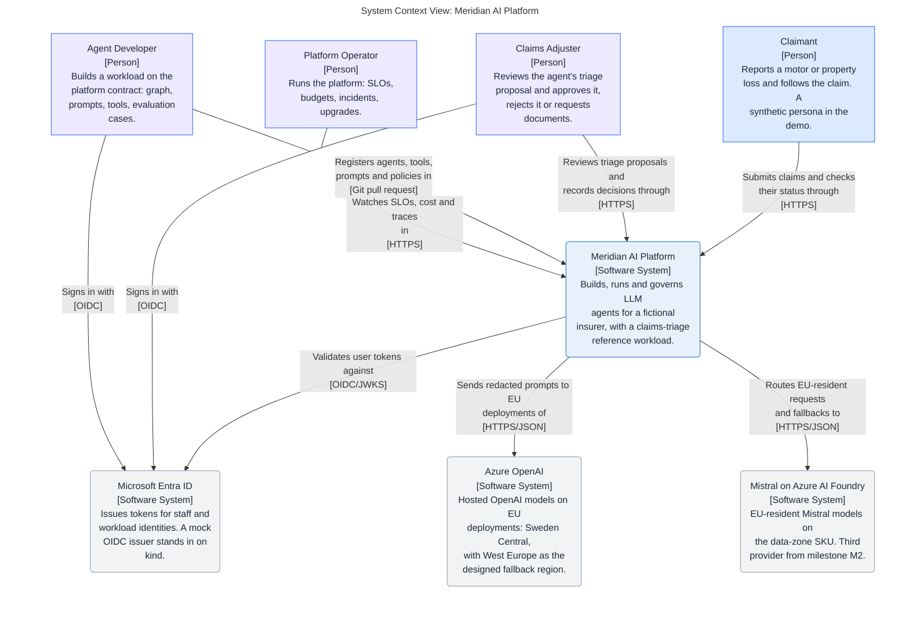

# Meridian AI Platform

A production-grade enterprise platform for building, running and governing
LLM agents, with a claims-triage reference workload for a fictional insurer.
Built and operated by one person as a portfolio project, designed as if a
platform team had to keep it alive.

**Status on 2026-10-02: bootstrap.** The architecture model, the first three
decisions, the engineering harness, a local platform on kind, the Azure
foundation, the platform registry and a walking skeleton of the Claims API,
the Agent Runtime and the Model Gateway exist; six services run on the
local kind cluster, where `make demo` triages a synthetic claim (in
replay mode: the model and the embeddings are simulated), the gateway
routes a call to Azure
OpenAI by data class and residency from a laptop, falls back to a second
deployment in the same region when the first fails and holds each tenant
to its rate limits and budgets, it answers embedding requests under the
same controls (in replay mode and against a mocked Azure, not yet run
against Azure), three MCP tool servers and the runtime's client for
them run on kind, the policy wordings are ingested into pgvector and
searched through one of those servers (with a simulated embedding), a
triage graph checks the policy, retrieves the wording's terms and lets
rules decide each claim's route (no real model has answered its one
question), and no service runs in Azure yet. Every capability below is
labelled implemented, simulated or designed; an unlabelled claim is a
documentation defect.

## Architecture at a glance

This diagram is the model's SystemContext view, generated by
`make mermaid-views`, so it changes only when the model does.

<!-- mermaid-view: SystemContext -->


## What it does, and what is real today

| Capability | Label | Where |
|---|---|---|
| Architecture model: context, container, governance and two runtime views | Designed | `docs/architecture/` |
| Decisions: Azure and kind with AWS designed; LangGraph behind a framework-agnostic contract; a thin model gateway | Accepted | `docs/architecture/decisions/` |
| Engineering harness: reviewers, skills, hooks, slash commands, an MCP server, permissions, documentation gate | Implemented | `.claude/`, `.agents/`, `.codex/`, `.mcp.json`, `scripts/` |
| Python workspace and CI gates: ruff, pytest, import contracts that keep the agent framework out of platform packages, with a test that plants violations | Implemented | `pyproject.toml`, `tests/meridian/`, `.github/workflows/python.yml` |
| Synthetic data and golden set: policies, claim history, four policy wordings and 40 first-notice-of-loss claims with expected outcomes, from a seeded generator whose reruns are identical | Implemented | `data/synthetic/` |
| Security and quality registers: threat model with T-IDs per trust boundary, data classification, quality attributes with initial targets | Designed | `docs/architecture/security/`, `docs/architecture/requirements/` |
| Agent framework spike: one claim flow with an approval pause in Microsoft Agent Framework and in LangGraph under one test suite, and the decision matrix in ADR 2 | Implemented as a spike, never deployed | `spikes/` |
| Local platform on kind: a Gateway API edge (Envoy Gateway), PostgreSQL 17 with pgvector (CloudNativePG), OpenTelemetry Collector, Prometheus, Grafana, Tempo and Loki from pinned Helm charts; `make up`, `make smoke`, `make down` | Implemented, laptop only | `infra/kind/` |
| Azure foundation: Terraform with its state in Azure Storage (Entra ID only), a 60-euro monthly budget with alerts at 50, 80 and 100 %, Key Vault, and Azure OpenAI `gpt-4o`, deployed twice as the gateway's two chat candidates, and `text-embedding-3-large` on regional deployments in Sweden Central with key authentication disabled; the West Europe fallback waits for the subscription's upgrade to pay-as-you-go | Implemented, persistent in a free-trial subscription of its own | `infra/terraform/` |
| Platform registry: models, providers, tools, agents, routing policies and tenants in YAML, with JSON Schemas generated from Pydantic models; `meridian registry validate` checks references, residency labels against SKU and region, personal data on EU labels only, idempotency keys on mutating tools, no decision tool in an allowlist, and the Azure deployments against Terraform's outputs, locally and in CI | Implemented; the gateway and the runtime load it at startup | `config/registry/`, `src/meridian/platform/registry/` |
| Walking skeleton: a claim posted to the Claims API starts a LangGraph run in the Agent Runtime, which calls the Model Gateway; the triage proposal is stored and one trace spans the services; a schema and a role per service with an insert-only audit table | Implemented in tests and on kind (S041, S044; laptop only): one image runs the six services, the Claims API answers at `claims.meridian.localhost:8088`, and `make demo` posts a synthetic claim and finds its one trace across the Claims API, the runtime, the policy and knowledge tool servers and the gateway; the gateway's replay provider is simulated | `src/meridian/`, `tests/meridian/test_walking_skeleton.py`, `Dockerfile`, `infra/kind/manifests/meridian/` |
| Model Gateway: provider and region per data class, fallback, quotas, budgets, cost, redaction, audit | Implemented in part: routing by data class and residency label, an Azure OpenAI adapter, an audited refusal and an audit record per call with the deployment's SKU, region and label (S010); a walk over the route's allowed candidates under one deadline, with a circuit breaker per deployment and an audit record per attempt, over two deployments in one region (S042). Per tenant, two rate windows, a daily token budget and a monthly cost quota, with the cost of each attempt reserved in a ledger before the provider is called; a call ID on every record of a call; tokens, cost and calls as OpenTelemetry metrics (S011). An embeddings endpoint under the same controls: the registry fixes each embedding deployment's vector length and refuses a route whose candidates differ in model or length, and a provider's answer with the wrong count or length is refused; the Azure embedding call is proven against a mocked transport and has not been run live (S045). Live calls run from a laptop with the developer's Azure login (`make gateway-live`); on kind the gateway answers in replay mode, simulated, and a replay embedding is a hashed bag of words that carries no meaning of the text. A reply is at most 1,024 tokens (S014). Designed: a fallback region (after the subscription's upgrade), a cost dashboard (S043), redaction and a data class per request (S047) | ADR 3, `src/meridian/platform/gateway/` |
| Agent Runtime with human approval on durable checkpoints | Designed, M1; starting a run and reading its status are implemented, a run is held to four model calls and sixteen tool calls (S014), approval and durable checkpoints arrive in S015 | ADR 2, `src/meridian/runtime/` |
| MCP tool servers for policies, policy wording and claims | Implemented in part (S013, S046), and running on kind (S044, laptop only): a Policy MCP server (policy lookup, claim history), a Claims MCP server (claim notes, approval requests) and a Knowledge MCP server (`wording_search` over the wording of the claim's own policy) on the official MCP SDK, and the runtime's tool client. A call is bound to its run's own claim, its policy or that policy's product, checked against the agent's allowlist and the registry's schemas on both sides, and audited in the transaction of its write; a write happens once per idempotency key. The policy store behind the policy server is simulated: tables seeded from the synthetic data. The knowledge server gets the query's vector from the Model Gateway under the run's tenant and agent; that embedding is simulated (replay mode only). On kind each server runs under its own database role, is reached by the runtime at its cluster name and answers only for that Host name; `make smoke` calls each through the runtime's client (a call for a run that does not exist, which every server refuses). The triage graph calls the three read tools (S014); nothing calls the two write tools yet (S015). Designed: service identity and a network policy between runtime and servers (S019) | `src/meridian/platform/toolserver/`, `src/meridian/platform/policy_mcp/`, `src/meridian/platform/knowledge_mcp/`, `src/meridian/workloads/claims_triage/mcp_server/`, `src/meridian/runtime/tool_client.py`, `api/mcp/` |
| Knowledge store and retrieval: the four policy wordings as 85 clause chunks with their vectors in PostgreSQL (pgvector), and a hybrid search over one product and wording version | Implemented in part (S012), and on kind (S044, laptop only), where `make deploy` ingests the wordings once per image: `meridian knowledge ingest` checks each wording against the generator's manifest, asks the Model Gateway for the embeddings as the job agent `knowledge-ingestion` and replaces the store in one transaction; the search fuses a keyword half (PostgreSQL full-text) and a vector half (exact cosine distance) by reciprocal rank, and refuses a store whose vectors another deployment made. The embedding is simulated: only the gateway's replay mode has run, a hashed bag of words, so the retrieval check's numbers say what word overlap finds, not what a model would. The knowledge tool server gives an agent the search (S046, the row above), bound to the product and wording version of the claim's own policy; each returned clause says whether it shares a term with the query, and a threshold for "no sufficient match" is designed, because none can be set against a simulated embedding | `src/meridian/platform/knowledge_mcp/`, `src/meridian/platform/migrations/0005_knowledge.sql`, `src/meridian/platform/migrations/0006_knowledge_server.sql`, `tests/meridian/knowledge_mcp/` |
| Claims triage: a graph checks the policy, loads its claim history, retrieves the wording's terms, asks the model whether an exclusion applies and proposes a route with citations | Implemented in part (S014); on kind since S044 (laptop only, replay mode). The graph's own code calls the three read tools in a fixed order, with search queries built from the claim's peril, never from claimant text. Rules decide the route: an automatic approval up to EUR 2,500 payable; an adjuster above it, for any fraud indicator, any exclusion or a policy not in force; a request for missing documents. A missing or uncertain fact can only stop an automatic approval: a clause the search did not return, exclusion clauses fewer than the wording has, a truncated claim history. The model answers one question, as JSON that is read strictly, and an answer that cannot be trusted sends the claim to an adjuster with the word that says why. A run that fails names its reason in the log and in its audit row. With a scripted model all 40 golden claims get the expected outcome; with the gateway's replay text, which is simulated and is no answer, the 15 claims that need the model go to a person and five are approved by the rules alone. No real model has answered the question. Nothing is approved, paid or closed yet: the proposal is stored, and approval, the claim lifecycle and durable checkpoints are S015. Designed: PII redaction, injection detection and a data class per request (S047) | `src/meridian/workloads/claims_triage/`, `src/meridian/platform/migrations/0007_triage_proposal.sql`, `tests/meridian/test_triage_stack.py` |
| Evaluation harness with a golden set and a CI gate | Designed, M1 | Architecture overview |
| SLOs, alerts and dashboards as code, runbooks, game-day incident record | Designed, M2 and M3 | Milestones |
| Hardened Helm charts for the platform services, Terraform for an ephemeral Azure environment, signed images | Designed, M2 | ADR 1 |

## Milestones

| Milestone | Outcome | Exit criterion |
|---|---|---|
| M0 Bootstrap | Repository, harness, model, first ADRs, synthetic data generator, kind cluster with the observability stack | `make docs` and `make check` pass; the generator produces the golden set |
| M1 Claims triage on kind | Gateway, three MCP servers, retrieval, triage graph with approval, adjuster UI, evaluation harness | The fifteen-minute demo runs from a clean checkout with `make` |
| M2 Azure, identity, delivery | Terraform, AKS, Entra ID, hardened charts, CI/CD with SBOM, scanning, signing and a manual approval gate | Environment created, demo on AKS, environment removed, all recorded |
| M3 Reliability and operations | Load test, game day and incident record, restore drill, provider swap, supervisor and worker agents, read-only console | SLO thresholds measured; the incident record comes from a real timeline |
| M4 Optional | AWS mapping with validate-only Terraform, or a second-framework workload, or a GraphRAG spike, or a workload scaffold command | One item, if time allows |

The step-by-step version, with dependencies, demo checkpoints and status, is
the [plan](docs/meridian-plan.md).

## Layout

```text
.claude/            rules (vendored from ECC), skills, agents, slash commands, hooks, settings
.agents/            byte-identical skill mirror for non-Claude agents
.codex/             Codex hooks, prompts, agent twins, config example
.mcp.json           the chrome-devtools MCP server, pinned
.github/workflows/  documentation gate; Python gates; architecture PDF release
api/mcp/            what each MCP tool server publishes, generated from the registry
config/registry/    platform registry: YAML, generated JSON Schemas, Terraform output snapshot
data/synthetic/     seeded generator, its committed output and the golden set
docs/
  README.md         documentation index
  architecture/     Structurizr model, views, ADRs, requirements; README.md is the front door
infra/kind/         local platform: pinned chart versions, values, the services' manifests; up, deploy, demo, smoke and down scripts
infra/terraform/    Azure foundation: Terraform root module, state bootstrap, plan, apply and smoke scripts
scripts/            documentation checker, PDF and Mermaid tooling, Codex agent generator
spikes/             throwaway experiments, each its own uv project; never deployed
src/meridian/       the one Python package (src layout)
  platform/         shared platform services (gateway, registry, migrations, the tool-server kit, the policy tool server, the knowledge store with its ingestion, search and tool server) and the meridian CLI; never import the agent framework
  runtime/          the Agent Runtime, which hosts LangGraph graphs; between workloads and platform
  workloads/        use cases built on the platform contract: the Claims API, its triage graph and its claims tool server
tests/              tests for the scripts and the bash guard
  meridian/         pytest tests for the package: import contracts, registry, services, tool servers, database, the walking skeleton, the kind manifests
  synthetic/        pytest tests for the generator: reruns, labels, citations
pyproject.toml      uv project: Python 3.13, the meridian command, dev tools, ruff, pytest, import-linter
uv.lock             locked dependency versions
Dockerfile          one image for the six services, the migrations, the policy seed and the ingestion; .dockerignore allowlists its context
Makefile            validate, inspect, check, docs, view, export, mermaid, pdf, lint, pytest, pytest-db, registry, synthetic, up, deploy, demo, smoke, grafana, down, azure-*
```

Planned, milestone by milestone: OpenAPI documents under `api/`, the
Terraform for the ephemeral Azure environment and the platform's own Helm
charts under `infra/`.

## Working in this repository

```bash
make docs     # documentation gate: twins, mirrors, links, indexes, ADRs, IDs
make check    # Structurizr validate + inspect with the pinned image (Docker)
make view     # browse the model at http://localhost:8080/workspace/1
make mermaid  # regenerate derived Mermaid blocks, render every fence (Docker)
make pdf      # the Documentation tab and every view as one PDF
make lint     # ruff, format check, import-linter contracts (needs uv)
make pytest   # package and generator tests, including the import-contract check (needs uv)
make pytest-db  # the same with a throwaway PostgreSQL container (with pgvector), so the database tests run too (Docker)
make registry # validate the registry, its schemas and the tool-server contracts under api/mcp, against the Terraform output snapshot (needs uv)
make synthetic  # regenerate data/synthetic from its seed; a rerun changes nothing (needs uv)
make up       # the local platform on kind; safe to rerun (Docker, kind, kubectl, helm, jq)
make demo     # build the image, migrate, seed, deploy the six services, ingest the wordings, post a claim, find its trace in Tempo
make smoke    # edge, pgvector, one call per tool server through the runtime's client, and a test trace, log and metric read back through Grafana
make grafana  # Grafana at http://127.0.0.1:3000; make grafana-password prints the password
make down     # delete the kind cluster; destructive
make azure-state  # once: the Terraform state storage in Azure (creates Azure resources)
make azure-plan   # plan the Azure foundation into a saved plan file
make azure-apply  # apply exactly that saved plan (changes Azure; the owner confirms)
make azure-smoke  # the deployments as planned, keys off, one chat and one embedding call with Entra ID
make gateway-live # two real chat calls and one embedding call through the gateway in live mode on this laptop, one chat call with the first candidate made to fail (az login, Docker)
make registry-snapshot  # refresh the registry's copy of Terraform's deployment outputs (read-only)
```

Agent instructions are in [CLAUDE.md](CLAUDE.md) and its twin
[AGENTS.md](AGENTS.md). The harness (reviewers, skills, hooks, permissions)
is described there; it is copied from the owner's development base, which
curates it from the owner's [ECC fork](https://github.com/Dezoxy/ECC) and
carries the architecture authoring kit.

## Documentation

- [docs/README.md](docs/README.md): index.
- [docs/architecture/README.md](docs/architecture/README.md): model, view
  register, decisions, requirements.

## Licence

[Apache License 2.0](LICENSE), copyright 2026 Dezoxy. The rules, skills and
reviewer agents copied from ECC stay under their MIT licence;
[NOTICE](NOTICE) lists them.
