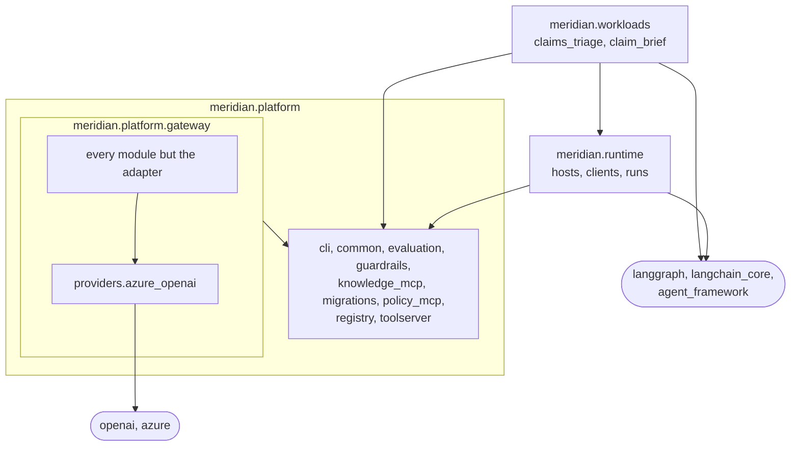

## Code layering and import rules

The views show what runs and what talks to what. This page shows a rule that
no view can: which Python package may import which. It is the level below the
containers, and it is a rule about source code, not about processes.

**Implemented.** The rules are six import-linter contracts in
[pyproject.toml](../../../pyproject.toml), under `[tool.importlinter]`.
`make lint` runs them, and the `python` workflow runs `make lint` on every
pull request. On 2026-10-07, on `main` at ae94424, `uv run lint-imports`
printed "Analyzed 237 files, 1446 dependencies" and "Contracts: 6 kept, 0
broken". The contracts read the packages under `src/meridian/` and nothing
else: a test file may import anything.

### What imports what

The three layers, the gateway inside the lowest one, and the two families of
libraries a contract guards. An arrow reads "imports". The diagram draws the
imports the code has today, counted on the same day; the table below says
which of the arrows that are missing a contract refuses.

Three things the diagram leaves out. The packages inside `meridian.platform`
import each other, and no contract orders them. The gateway's rate store
imports `redis`, which the third contract keeps out of every other package.
And no package outside the gateway imports the gateway today, although the
contracts refuse such an import only when its chain ends in a provider's
library.

### The contracts

"Chain" says whether an import through other modules counts, or only a direct
one.

| Contract, as `pyproject.toml` names it | Refuses | Chain | Why |
|---|---|---|---|
| workloads build on the platform, never the reverse | `meridian.platform` importing `meridian.runtime` or `meridian.workloads`, and `meridian.runtime` importing `meridian.workloads` | Counts | A workload is replaceable and the platform is not built around one |
| platform never imports the agent framework (ADR 2) | Any module under `meridian.platform` importing `langgraph`, a `langchain` distribution, `agent_framework` or one of its adapters | Counts | [ADR 2](../decisions/0002-langgraph-behind-a-framework-agnostic-contract.md) and [ADR 9](../decisions/0009-run-a-second-agent-framework-behind-the-same-host-protocol.md): the platform's contract does not depend on a framework, so a second one could be hosted |
| only the gateway imports a provider SDK (hard rule 4, T-19) | The workloads, the runtime and the nine platform packages that are not the gateway importing `openai`, `azure`, `mistralai`, `anthropic`, `boto3`, `botocore`, `litellm`, a framework adapter that calls a model, or `redis` | Counts | [ADR 3](../decisions/0003-build-a-thin-model-gateway.md): every model call passes the gateway's routing, redaction, budgets and audit |
| inside the gateway only the Azure OpenAI adapter imports a provider SDK | A gateway module other than `providers.azure_openai` importing one of those libraries | Direct only | The provider's types stay in one file, so a second provider is a second adapter |
| the gateway imports neither the evaluation package nor the CLI | `meridian.platform.gateway` importing `meridian.platform.evaluation` or `meridian.platform.cli` | Counts | A deployed service does not depend on the package that loads workloads and holds a client of the gateway (T-78) |
| the claim brief imports no HTTP client (S037) | `meridian.workloads.claim_brief` importing `httpx`, `requests` or `aiohttp` | Direct only | A step of that workload cannot post to a model by itself |

`tests/meridian/test_import_contracts.py` breaks each contract in a copy of
the tree and expects the linter to say so, and fails when a new package under
`src/meridian/platform/` is missing from the third contract's list.

### Inside one container: the Agent Runtime

The import rules say what a package may reach. What sits inside one running
service is a view of the model. One exists, of the Agent Runtime, where the
layering is a decision
([ADR 2](../decisions/0002-langgraph-behind-a-framework-agnostic-contract.md),
[ADR 9](../decisions/0009-run-a-second-agent-framework-behind-the-same-host-protocol.md)):
two hosts behind one protocol, and one client each for the model and the
tools. **Implemented**, and read from the code, not run. The other containers
have no component view.

A component is a responsibility of the running service, not a file. The view
register in the architecture README says which parts of the package are left
out and why.

**Update trigger:** a contract in `pyproject.toml` is added, removed or
changed, or a module of the runtime gains or loses a responsibility. The
plan's step S082 adds a contract per service and moves the workloads' graphs
into a package of their own, which changes the diagram, the table and the
view.
