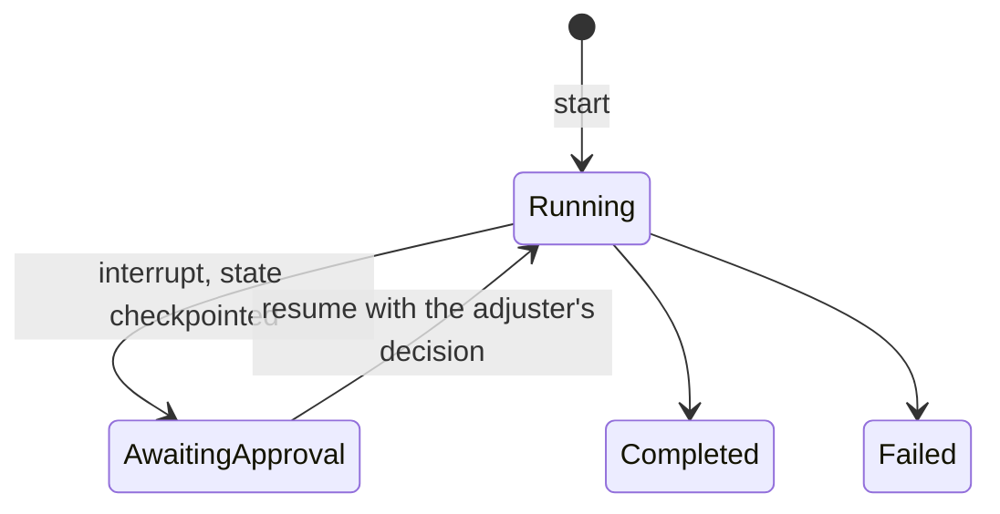

# 2. Run LangGraph behind a framework-agnostic platform contract

Date: 2026-09-29

## Status

Accepted

## Context

An agent framework structures how an agent runs: the state machine, the tool
calling loop, memory, checkpoints and the pause for human approval. The
candidates were LangGraph, Microsoft Agent Framework with Semantic Kernel,
AutoGen, CrewAI and LlamaIndex agents. Two of the target roles list these
frameworks; one asks for deep hands-on expertise in at least two. The earlier
proposal was to build the claims workflow in LangGraph and re-implement the
same workflow in Semantic Kernel as an adapter to show portability.

The platform's value is what sits around the framework: model access with
policy, tool integration, retrieval, evaluation, telemetry, identity. A second
copy of one workflow would cost about two weeks and prove only that the copy
exists.

## Decision drivers

- C-01: one maintainer; duplicated workflows are the first thing to rot.
- Separation of shared platform capabilities from use-case implementations,
  the core responsibility of an enterprise agent platform.
- Evidence quality: a boundary enforced by CI beats two implementations.
- Human-in-the-loop with durable checkpoints is required by the workload.

## Considered options

1. LangGraph everywhere, including platform packages.
2. LangGraph inside workloads, a framework-agnostic platform contract, and a
   framework decision matrix backed by a one-day spike in Microsoft Agent
   Framework.
3. Option 2 plus a second implementation of the claims workflow in Semantic
   Kernel or Microsoft Agent Framework.
4. Microsoft Agent Framework as the primary runtime.

## Decision

Option 2. Rules:

- Platform packages (`src/meridian/platform/*`: gateway, MCP servers, knowledge,
  evaluation harness, registry, common) must not import `langgraph` or
  `langchain*`. An import-linter contract in CI fails the build on a
  violation.
- The Agent Runtime exposes a small contract to workloads: start a run,
  resume a paused run, read run status, a checkpoint store and a tool client.
  The runtime hosts LangGraph graphs today; the contract does not name the
  framework.
- The claims-triage workload is a LangGraph graph with a PostgreSQL
  checkpointer; approval is a graph interrupt.
- A framework decision matrix (state handling, tool contracts, approval
  pauses, checkpointing, ecosystem, licence) is added to this record as an
  appendix when the one-day Microsoft Agent Framework spike is done in
  milestone M0; the spike itself is kept under `spikes/` with notes. A second
  workload in that framework is an optional milestone M4 item.

The lifecycle of one run under this contract:

## Consequences

Positive:

- Framework choice becomes a workload concern; the platform can be shown to
  accept another framework without a second copy of anything.
- One framework to learn deeply for the reference workload.

Negative / accepted trade-offs:

- Only one framework has production-grade code in the repository; the second
  is evidenced by a spike and a matrix.
- The contract is a small abstraction to maintain.

Rejected options:

- Option 1: couples the platform to one vendor's release cadence.
- Option 3: two weeks for thin evidence.
- Option 4: ~~less mature checkpoint and interrupt support at the time of
  writing; revisit if the spike contradicts this.~~ The S005 spike
  contradicted it: Microsoft Agent Framework 1.19 pauses, checkpoints and
  resumes across processes as well as LangGraph does. It stays rejected on a
  narrower ground, set out in the appendix: LangGraph ships a stable
  PostgreSQL checkpoint store and Microsoft Agent Framework does not, so this
  project would write and maintain the store that holds paused runs and
  their personal data.

## Risks

- The runtime contract may leak framework concepts, for example the graph
  state shape. Mitigation: the platform-boundary reviewer checks the contract
  before the first workload lands.

## Related

- Requirements: C-01
- Architecture views: Containers, ClaimsTriage, ClaimsApproval
- Other ADRs: [3. Build a thin model gateway](0003-build-a-thin-model-gateway.md)

## Appendix: framework decision matrix

Added by plan step S005 on 2026-09-29 and revised on 2026-09-30 after review.
Every cell is a measurement unless it says otherwise: the same three-step
claim flow with an approval pause was built in Microsoft Agent Framework
(`agent-framework-core` 1.19.0) and in LangGraph 1.2.12 with
`langgraph-checkpoint-sqlite` 3.1.1, and one test suite runs against both. No
model is called. The code, the tests and the source line behind each cell are
in `spikes/s005-agent-framework/`. The LangGraph twin exists so that both
columns are measured; it is spike code, never deployed, and not the second
workload implementation of option 3.

The first version addressed Microsoft Agent Framework runs by checkpoint ID
and LangGraph runs by a stable thread ID, which made one row unfair. An
independent review of each column caught that and several other cells before
merge; the spike README records what changed.

| Criterion | Microsoft Agent Framework | LangGraph |
|---|---|---|
| State handling | Typed messages between executors, plus an untyped shared key/value state saved in every checkpoint | One typed state per thread; each node returns an update to it |
| Routing | Switch-case edge groups over the message | Conditional edges that return the next node's name |
| Tool contracts | A decorated function gives a JSON Schema from its signature and docstring; the tool carries an approval mode and invocation limits, used by the agent tool loop, not by workflows | The same schema through `langchain_core`'s decorator; no approval or limit fields on the tool; approval is `interrupt()` inside the tool |
| Approval pause | `request_info` with a response type; the payload is coerced and type-checked | `interrupt` with a response schema, validated when it is a Pydantic model, dataclass or `TypedDict`; the node reruns from its first line on resume |
| Payload validation | Types always; value rules when the response type carries them | The same through the response schema; an empty resume re-pauses without an error, and a refused payload stays stored until the next resume |
| Bad resumes, run addressed by its own ID | Refuses a completed run and a second resume of the same pause; an unknown run has no checkpoint, which the caller turns into a refusal | Refuses none: an unknown thread ID starts a new thread, and resuming a completed or already decided run returns the first result and drops the payload. `get_state` gives the signal to refuse all three |
| Replay and concurrency | Resuming from an explicit checkpoint ID replays it, by design; two resumes at once both complete, with different outcomes | Going back to the pause checkpoint lands a second decision too; two resumes at once are never refused, and the two callers can be told different outcomes while only one is stored |
| Run identity | None of its own: a run is a lineage of checkpoints grouped by a workflow name the application chooses; the name is not checked on restore | A thread ID the caller chooses |
| Checkpoint format | Pickle in every first-party store, behind an allowlist that its documentation calls no security boundary. The storage protocol is public: a pickle-free JSON store is in the spike | msgpack. By default any importable type is revived, and its documentation warns of code execution from a writable store; strict mode limits the types but turns unlisted ones into plain dicts |
| Failed save | Logs a warning and still reports the pause; the caller must check `resolve_pause_checkpoint_id` | Raises from `invoke`, but in the default durability mode only after the nodes have run |
| Checkpoint contents | Whatever the flow keeps in messages or shared state, personal data included; nothing deleted on completion | The same, readable in the raw bytes; `delete_thread` and an encrypting serializer exist |
| PostgreSQL checkpoint store | None. First-party stores: in-memory, file, Cosmos DB (beta) and Foundry (beta) | `langgraph-checkpoint-postgres` 3.1.2, a stable release (not run in the spike) |
| Telemetry | Native spans per workflow, executor, edge group and message; they carry IDs and types, not payloads | None of its own; a callback handler gives a span per node |
| Footprint | 10 packages, no provider SDK | 41: 38 for LangGraph and 3 for the SQLite saver, `langchain-core` and `langsmith` among them; no provider SDK |
| Ecosystem (read from PyPI on 2026-09-29, not run) | Core 1.19.0; the persistent stores and most integrations are alpha or beta pre-releases | The PostgreSQL saver is a stable release; tools come from `langchain-core` |
| Licence | MIT | MIT |

### Reading the matrix

Used as each framework documents, the two are closer than a first reading
suggested. Both pause, checkpoint and resume across processes; both refuse a
malformed payload; both replay a pause when a caller addresses its checkpoint
directly; neither stops two decisions that arrive at once. Both need their
checkpoints hardened: Microsoft Agent Framework through a custom store,
because every first-party store pickles, and LangGraph through strict msgpack
and a state that holds only primitives.

Microsoft Agent Framework is ahead on the pause, which is typed and refuses
bad resumes without caller code, on telemetry and on footprint, and it sits
closer to the Azure stack of ADR 1. LangGraph stays the workload framework
for one reason the matrix supports, and a smaller second one:

- The checkpoint store holds paused runs and their personal data, and it
  belongs in the Platform Database. LangGraph ships a stable PostgreSQL
  store. With Microsoft Agent Framework this project would write and maintain
  one, with its lineage, pending responses and concurrent writers: the most
  safety-critical storage in the platform, kept by one maintainer (C-01).
- A failed save raises in LangGraph without caller code; in Microsoft Agent
  Framework the caller has to ask whether the pause was saved.

The margin is narrow. The runtime contract keeps the framework out of the
platform packages, so a later switch would rewrite the workload and the
runtime host, not the platform.

### What the runtime contract takes on

- **Run identity.** The runtime issues the run ID and maps it to the
  framework's thread; no caller sees a framework handle (S009).
- **Resume once.** The runtime moves a run from awaiting approval to running
  in one conditional update before it calls the framework, and refuses an
  unknown, completed or already decided run itself. Neither framework stops
  concurrent resumes, and both replay a pause addressed by checkpoint ID
  (T-10, S015).
- **Adjuster identity from the sign-in.** The payload type can refuse an
  empty adjuster ID in either framework, but only the sign-in can say who
  decided (T-32, S015).
- **Hardened checkpoints.** `LANGGRAPH_STRICT_MSGPACK=true`, set before
  LangGraph is imported; graph state holds only primitives and dicts, because
  strict mode turns other types into dicts without an error; a completed
  run's checkpoints are deleted with `delete_thread` or kept free of claim
  text, and S015 chooses which.
- **Saves.** `durability="sync"`, the pause read from the interrupts rather
  than the next node, and idempotency keys on mutating tools, because in the
  default mode nodes can run before a failed save surfaces (QA-08).
- **Spans.** LangGraph emits none of its own, so the runtime passes a
  callback handler that opens a span per node, keeping one trace across API,
  runtime and gateway (S009).

Amended on 2026-10-03 (S015): a finished run's checkpoints are deleted
with `delete_thread`, after its status is recorded, and they live in
PostgreSQL under LangGraph's own saver. The adjuster's identity moved to
S021 (T-32), so S015 records a decision without it. A resume is addressed
to the pending pause by its interrupt ID, because LangGraph reads a resume
value whose keys all look like interrupt IDs, an empty object among them,
as a map of pauses. The claims workload's run reads the adjuster's
decision from the Claims API's record, not from the resume.
