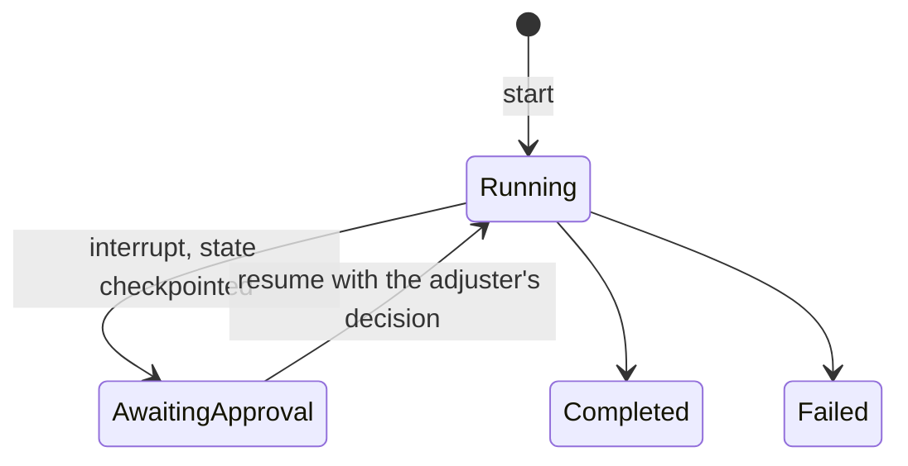

# 2. Run LangGraph behind a framework-agnostic platform contract

Date: 2026-09-29

## Status

Accepted

## Context

An agent framework structures how an agent runs: the state machine, the tool
calling loop, memory, checkpoints and the pause for human approval. The
candidates were LangGraph, Microsoft Agent Framework with Semantic Kernel,
AutoGen, CrewAI and LlamaIndex agents. Two of the target roles list these
frameworks; one asks for deep hands-on expertise in at least two. The earlier
proposal was to build the claims workflow in LangGraph and re-implement the
same workflow in Semantic Kernel as an adapter to show portability.

The platform's value is what sits around the framework: model access with
policy, tool integration, retrieval, evaluation, telemetry, identity. A second
copy of one workflow would cost about two weeks and prove only that the copy
exists.

## Decision drivers

- C-01: one maintainer; duplicated workflows are the first thing to rot.
- Separation of shared platform capabilities from use-case implementations,
  the core responsibility of an enterprise agent platform.
- Evidence quality: a boundary enforced by CI beats two implementations.
- Human-in-the-loop with durable checkpoints is required by the workload.

## Considered options

1. LangGraph everywhere, including platform packages.
2. LangGraph inside workloads, a framework-agnostic platform contract, and a
   framework decision matrix backed by a one-day spike in Microsoft Agent
   Framework.
3. Option 2 plus a second implementation of the claims workflow in Semantic
   Kernel or Microsoft Agent Framework.
4. Microsoft Agent Framework as the primary runtime.

## Decision

Option 2. Rules:

- Platform packages (`src/meridian/platform/*`: gateway, MCP servers, knowledge,
  evaluation harness, registry, common) must not import `langgraph` or
  `langchain*`. An import-linter contract in CI fails the build on a
  violation.
- The Agent Runtime exposes a small contract to workloads: start a run,
  resume a paused run, read run status, a checkpoint store and a tool client.
  The runtime hosts LangGraph graphs today; the contract does not name the
  framework.
- The claims-triage workload is a LangGraph graph with a PostgreSQL
  checkpointer; approval is a graph interrupt.
- A framework decision matrix (state handling, tool contracts, approval
  pauses, checkpointing, ecosystem, licence) is added to this record as an
  appendix when the one-day Microsoft Agent Framework spike is done in
  milestone M0; the spike itself is kept under `spikes/` with notes. A second
  workload in that framework is an optional milestone M4 item.

The lifecycle of one run under this contract:

## Consequences

Positive:

- Framework choice becomes a workload concern; the platform can be shown to
  accept another framework without a second copy of anything.
- One framework to learn deeply for the reference workload.

Negative / accepted trade-offs:

- Only one framework has production-grade code in the repository; the second
  is evidenced by a spike and a matrix.
- The contract is a small abstraction to maintain.

Rejected options:

- Option 1: couples the platform to one vendor's release cadence.
- Option 3: two weeks for thin evidence.
- Option 4: less mature checkpoint and interrupt support at the time of
  writing; revisit if the spike contradicts this.

## Risks

- The runtime contract may leak framework concepts, for example the graph
  state shape. Mitigation: the platform-boundary reviewer checks the contract
  before the first workload lands.

## Related

- Requirements: C-01
- Architecture views: Containers, ClaimsTriage, ClaimsApproval
- Other ADRs: [3. Build a thin model gateway](0003-build-a-thin-model-gateway.md)
