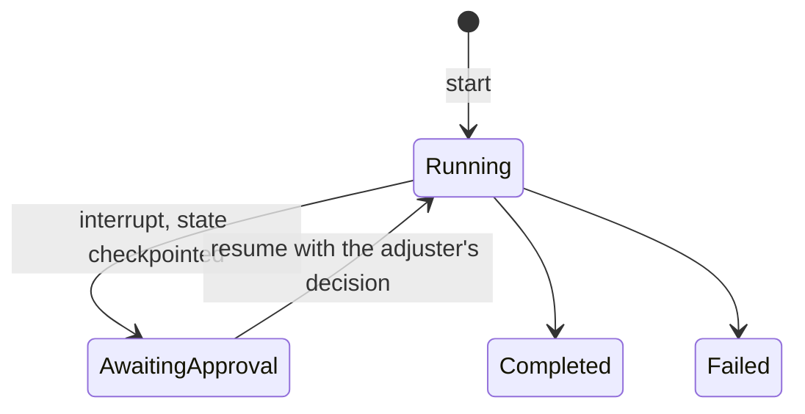

# 2. Run LangGraph behind a framework-agnostic platform contract

Date: 2026-09-29

## Status

Accepted

## Context

An agent framework structures how an agent runs: the state machine, the tool
calling loop, memory, checkpoints and the pause for human approval. The
candidates were LangGraph, Microsoft Agent Framework with Semantic Kernel,
AutoGen, CrewAI and LlamaIndex agents. Two of the target roles list these
frameworks; one asks for deep hands-on expertise in at least two. The earlier
proposal was to build the claims workflow in LangGraph and re-implement the
same workflow in Semantic Kernel as an adapter to show portability.

The platform's value is what sits around the framework: model access with
policy, tool integration, retrieval, evaluation, telemetry, identity. A second
copy of one workflow would cost about two weeks and prove only that the copy
exists.

## Decision drivers

- C-01: one maintainer; duplicated workflows are the first thing to rot.
- Separation of shared platform capabilities from use-case implementations,
  the core responsibility of an enterprise agent platform.
- Evidence quality: a boundary enforced by CI beats two implementations.
- Human-in-the-loop with durable checkpoints is required by the workload.

## Considered options

1. LangGraph everywhere, including platform packages.
2. LangGraph inside workloads, a framework-agnostic platform contract, and a
   framework decision matrix backed by a one-day spike in Microsoft Agent
   Framework.
3. Option 2 plus a second implementation of the claims workflow in Semantic
   Kernel or Microsoft Agent Framework.
4. Microsoft Agent Framework as the primary runtime.

## Decision

Option 2. Rules:

- Platform packages (`src/meridian/platform/*`: gateway, MCP servers, knowledge,
  evaluation harness, registry, common) must not import `langgraph` or
  `langchain*`. An import-linter contract in CI fails the build on a
  violation.
- The Agent Runtime exposes a small contract to workloads: start a run,
  resume a paused run, read run status, a checkpoint store and a tool client.
  The runtime hosts LangGraph graphs today; the contract does not name the
  framework.
- The claims-triage workload is a LangGraph graph with a PostgreSQL
  checkpointer; approval is a graph interrupt.
- A framework decision matrix (state handling, tool contracts, approval
  pauses, checkpointing, ecosystem, licence) is added to this record as an
  appendix when the one-day Microsoft Agent Framework spike is done in
  milestone M0; the spike itself is kept under `spikes/` with notes. A second
  workload in that framework is an optional milestone M4 item.

The lifecycle of one run under this contract:

## Consequences

Positive:

- Framework choice becomes a workload concern; the platform can be shown to
  accept another framework without a second copy of anything.
- One framework to learn deeply for the reference workload.

Negative / accepted trade-offs:

- Only one framework has production-grade code in the repository; the second
  is evidenced by a spike and a matrix.
- The contract is a small abstraction to maintain.

Rejected options:

- Option 1: couples the platform to one vendor's release cadence.
- Option 3: two weeks for thin evidence.
- Option 4: ~~less mature checkpoint and interrupt support at the time of
  writing; revisit if the spike contradicts this.~~ The S005 spike
  contradicted it: Microsoft Agent Framework 1.19 pauses, checkpoints and
  resumes across processes, and refuses more bad resumes than LangGraph. It
  stays rejected for the reasons in the appendix: pickled checkpoints, no
  PostgreSQL checkpoint store, and a failed checkpoint save that does not
  fail the run.

## Risks

- The runtime contract may leak framework concepts, for example the graph
  state shape. Mitigation: the platform-boundary reviewer checks the contract
  before the first workload lands.

## Related

- Requirements: C-01
- Architecture views: Containers, ClaimsTriage, ClaimsApproval
- Other ADRs: [3. Build a thin model gateway](0003-build-a-thin-model-gateway.md)

## Appendix: framework decision matrix

Added by plan step S005 on 2026-09-29. Every cell is a measurement unless it
says otherwise: the same three-step claim flow with an approval pause was
built in Microsoft Agent Framework (`agent-framework-core` 1.19.0) and in
LangGraph 1.2.12 with `langgraph-checkpoint-sqlite` 3.1.1, and one test suite
runs against both. No model is called. The code, the tests and the source
line behind each cell are in `spikes/s005-agent-framework/`. The LangGraph
twin exists so that both columns are measured; it is spike code, never
deployed, and not the second workload implementation of option 3.

| Criterion | Microsoft Agent Framework | LangGraph |
|---|---|---|
| State handling | Typed messages passed between executors; a step sees only the message it receives | One typed state per thread; each node returns an update to it |
| Routing | Switch-case edge groups over the message | Conditional edges that return the next node's name |
| Tool contracts | A decorated function gives a JSON Schema from its signature and docstring; the tool carries an approval mode and invocation limits | Needs `langchain_core`'s decorator; the same schema; no approval or limit fields |
| Approval pause | `request_info` with a response type; the payload is coerced and type-checked, `Literal` values included | `interrupt` with a response schema, validated only when it is a Pydantic model, dataclass or `TypedDict`; the node reruns from its first line on resume |
| Bad resumes | Refuses an unknown run and a completed run. A second resume from the same pause replays it: two completed runs, two different outcomes | Refuses neither. An unknown thread ID starts a new thread; resuming a completed run, or resuming twice, returns the first result and drops the new payload without a signal |
| Run identity | None of its own: the handle is a checkpoint ID that changes at every step | A thread ID the caller chooses, stable from start to completion |
| Checkpoint format | JSON with base64 pickles behind an allowlist that the framework's own documentation says is not a security boundary. A failed save logs a warning and the run goes on | msgpack in SQLite; deserialization is permissive unless `LANGGRAPH_STRICT_MSGPACK=true`. Save failure not tested |
| Checkpoint contents | The claimant's name, e-mail and description in the checkpoints the claim passed through, base64-encoded; nothing deleted on completion | The same data, readable in the raw bytes; nothing deleted on completion |
| PostgreSQL checkpoint store | None. `agent-framework-postgres` 1.0.0a260910 is an alpha vector store (read from its package description) | `langgraph-checkpoint-postgres` 3.1.2 (not run in the spike) |
| Telemetry | Native OpenTelemetry spans per workflow, executor, edge group and message; payloads stay out unless sensitive data is switched on | No OpenTelemetry of its own: zero spans under the same tracer provider |
| Footprint | 10 packages, no provider SDK | 41 packages with the SQLite saver, `langchain-core` and `langsmith` among them; no provider SDK |
| Flow code | 152 non-blank lines, including the pickle allowlist and pause addressing | 92 non-blank lines |
| Licence | MIT | MIT |

### Reading the matrix

The reason this record gave for rejecting option 4 no longer holds. Microsoft
Agent Framework has the better pause: a typed response, refusals for an
unknown or completed run, and native telemetry at a quarter of the footprint.
LangGraph stays the workload framework for three reasons that the matrix
supports:

- Checkpoints hold personal data (see the data classification) and belong
  in the Platform Database. LangGraph has a PostgreSQL saver and a strict msgpack
  mode; Microsoft Agent Framework would store pickles and has no PostgreSQL
  checkpoint store, so this project would write one.
- A failed checkpoint save in Microsoft Agent Framework does not fail the
  run, so a run can report a pause with nothing durable behind it, which is
  what QA-08 guards against.
- Neither framework enforces T-10: both let one pause be decided twice, one
  by replaying and one by dropping the second decision silently. The runtime
  enforces it either way, so the better pause is not decisive.

### What the runtime contract takes on

- **Run identity.** The runtime issues the run ID and maps it to the
  framework's thread; no caller sees a framework handle (S009).
- **Resume once.** The runtime moves a run from awaiting approval to running
  in one conditional update before it calls the framework, and refuses an
  unknown, completed or already decided run itself (T-10, S015).
- **Adjuster identity from the sign-in.** Both frameworks accept an empty
  adjuster ID, so the decision's adjuster comes from the authenticated caller,
  never from the payload (T-32, S015).
- **Strict checkpoints.** `LANGGRAPH_STRICT_MSGPACK=true`, and a completed
  run's checkpoints are deleted or kept free of claim text; S015 chooses which.
- **Spans.** LangGraph emits none, so the runtime opens a span per node to
  keep one trace across API, runtime and gateway (S009).
