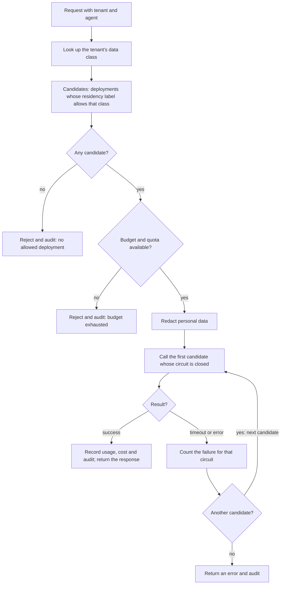

# 3. Build a thin model gateway instead of adopting LiteLLM

Date: 2026-09-29

## Status

Accepted

## Context

Every agent needs models, and the enterprise questions cluster there: which
provider and region may see this data, what happens when a provider fails,
who pays, and what was sent. One of the target roles owns exactly this
component in production: credentials, quotas, routing rules, fallback, rate
limits, and auditable records of model access and cost.

Provider facts verified on 2026-09-29 in the owner's subscription: Azure
OpenAI offers EU-resident deployments (regional `Standard` and EU-wide
`DataZoneStandard` SKUs) for the chosen models in Sweden Central and West
Europe; Mistral Large 3 is available on the data-zone SKU through Azure AI
Foundry; every Claude model in Azure AI Foundry is `GlobalStandard` only, so
EU-resident Claude means AWS Bedrock in an EU region.

## Decision drivers

- C-02: provider and region must be a policy per data class, enforced and
  recorded per call.
- C-04: two providers plus a deterministic replay provider keep cost and keys
  manageable.
- Interview evidence: owning the routing, fallback and budget code is
  stronger than configuring a product, provided the component stays small.
- The gateway is where a new model version is onboarded, so its registry
  entry must carry residency, data classes, price and deprecation date.

## Considered options

1. LiteLLM proxy, configured.
2. A thin gateway of our own on FastAPI with direct provider SDKs.
3. A gateway of our own using the LiteLLM Python library as the adapter
   layer.
4. Azure API Management with its AI gateway policies.
5. OpenRouter as the provider.

## Decision

Option 2. Scope of the gateway, and nothing more: provider adapters for Azure
OpenAI, Mistral on Azure AI Foundry and a replay provider for CI; routing by
registry policy (data class to allowed deployments); timeout, retry, circuit
breaker and fallback; per-tenant quotas, rate limits and token budgets; cost
metering; a PII redaction hook; OpenTelemetry spans with tenant, agent,
model, provider, tokens and cost; an audit record per call including
provider, deployment, SKU and region. About 1,500 to 2,000 lines with tests.

The routing decision for one call, from request to response or refusal:

Provider set: Azure OpenAI `gpt-4.1-mini` on `DataZoneStandard` in Sweden
Central with a West Europe deployment as fallback (milestone M1); Mistral
Large 3 on Azure AI Foundry (M2); Claude on AWS Bedrock in Frankfurt as an
optional M3 or M4 adapter.

Amended on 2026-09-30 (S007): Meridian moved to a new free-trial
subscription, where Azure OpenAI has no EU quota for `gpt-4.1-mini` and no
current chat model on an EU SKU in West Europe. Until that subscription is
upgraded to pay-as-you-go, M1 uses `gpt-4o` 2024-11-20 on regional
`Standard` in Sweden Central, labelled `eu-region`, with no second region,
because Azure no longer accepts new `gpt-4o-mini` deployments; the fallback
stays designed. The gateway's contract does not change: a deployment is a
registry entry.

Amended on 2026-10-01 (S042): the gateway walks a route's allowed
candidates as the flowchart draws it, with two readings made exact. A
retry is the next candidate, never the same deployment again. And only a
deployment's own failure counts for its circuit and moves the walk on: a
timeout, a connection failure, a 5xx, a 404, a 429 or a malformed answer.
A request the provider rejects and a credential that fails end the call
and count for nothing, or one caller could open the circuit for everyone
(T-45). The chat route has two candidates, both `gpt-4o` in the one
Sweden Central account, so the walk answers a deployment that fails or is
rate-limited; the fallback to a second region stays designed.

Amended on 2026-10-01 (S011): the flowchart's one box for budget and quota
is two checks. Before the walk, the tenant's two rate windows, which are
the provider's own (requests per 10 s, tokens per minute), kept in the
process. Inside the walk, a reservation per candidate, written to
PostgreSQL before the provider is called: the estimated input plus the
output cap, against the tenant's daily token budget and monthly cost quota,
as one conditional update per counter, so concurrent calls cannot pass the
same check (T-47). "Record usage and cost" closes that reservation: the
provider's counts when it answered, nothing when it refused the request
with a 4xx or nothing was sent, and the reservation itself in every other
case, because a request the gateway gave up on may still be billed. Cost is
an estimate from the registry's list prices at a dated planning rate; the
invoice is the provider's. The tenant is still the caller's word until
sign-in exists (T-08, T-48).

Amended on 2026-10-06 (S025): the mapping ADR of S025 records, from AWS's
model cards read that day, that Claude on AWS Bedrock in Frankfurt is
`eu-zone` and not `eu-region`: no current Claude model has in-Region
inference in Frankfurt, so Claude is called there through the `eu.`
geographic profile, whose destinations are all in EU member states when the
call is made from Frankfurt. It stays EU-resident; the sentences above that
name Claude on Bedrock in an EU region or in Frankfurt are read with that
label.

## Consequences

Positive:

- Every failure mode of routing, fallback and budgeting is ours to explain.
- Minimal dependency surface; the "provider change absorbed" demonstration
  is a registry change plus consumer contract tests.
- Residency becomes an attribute of a deployment and data class an attribute
  of a tenant; the gateway refuses a mismatch.

Negative / accepted trade-offs:

- About one week of milestone M1.
- Few providers and no administration UI; the registry in git and the
  read-only console (M3) stand in.
- Features such as semantic caching or prompt management are out of scope.

Rejected options:

- Option 1: fast, but the evidence is configuration, the dependency surface
  is large and its data model would become ours.
- Option 3: saves little with two providers and blurs what was built.
- Option 4: a credible enterprise choice, but Azure-specific and not runnable
  on kind; it appears in the AWS mapping as the managed alternative.
- Option 5: no control over which sub-processor sees data, and it is the
  kind of component this gateway is.

Reconsider when more than four provider API families are needed, or when
several teams need self-service beyond the registry.

## Risks

- Scope creep into a product. Mitigation: the scope list above is the
  contract; additions need a new ADR.

## Related

- Requirements: C-02, C-04
- Architecture views: Containers, Governance, ClaimsTriage
- Other ADRs: [1. Run on Azure and kind](0001-run-on-azure-and-kind-design-aws.md),
  [2. LangGraph behind a framework-agnostic contract](0002-langgraph-behind-a-framework-agnostic-contract.md)
