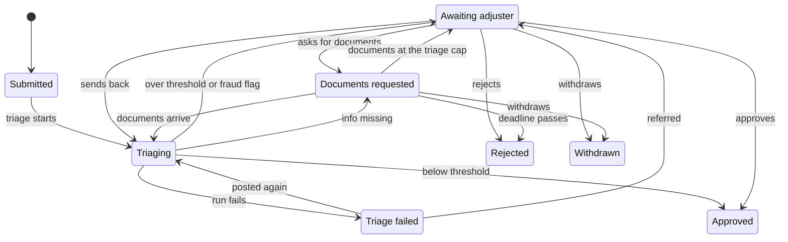

## Architecture Overview

### Purpose

The Meridian AI Platform lets teams at Meridian Insurance, a fictional insurer,
build, run and govern LLM agents without each team re-solving model access,
tool integration, retrieval, evaluation, identity and telemetry. The platform
is the product; a claims-triage agent is its reference workload.

### Status

Target architecture, recorded on 2026-09-29. Nothing in this model is deployed
yet. The view register in the architecture README says, per view, whether it
has been checked against running software. Every capability in this
documentation carries one of three labels: implemented, simulated or designed.

### Context

Claimants report motor or property losses. The claims-triage workload
validates the policy, retrieves the relevant coverage terms, screens for fraud
indicators and drafts a structured proposal. Above a risk threshold the run
pauses and a claims adjuster decides. Model calls leave the platform only
through the Model Gateway, which chooses the provider and region by data
classification and records every decision.

### Claim lifecycle

The states a claim passes through in the reference workload. The triage run
drafts a proposal. Below the risk threshold and without a fraud flag the
workload approves the claim itself; otherwise a claims adjuster decides
(C-02). Triage and the adjuster can both ask the claimant for documents, and
arriving documents trigger a new triage run. A claim is triaged at most five
times; documents that arrive after that refer it to an adjuster. The adjuster
can send a claim back to triage. A claim whose triage run fails can be triaged
again, or be referred to an adjuster. A claimant can withdraw while the claim
waits, and a claim whose documents miss the deadline is closed as rejected.
Approved, Rejected and Withdrawn are final.

Implemented in part (S015, S048): the Claims API keeps every claim in one of
these states and moves it only along these edges. Every edge is implemented
except the deadline, which a scheduled job closes (S052).

### Building blocks

| Container | Responsibility | Technology | Plane |
|---|---|---|---|
| Ingress | TLS termination and routing | Envoy Gateway (Gateway API) on kind; Application Gateway WAF in the Azure design | Edge |
| Model Gateway | Provider and region policy, fallback, quotas, budgets, cost, redaction, audit | Python, FastAPI | Control |
| Agent Runtime | Hosts workload graphs: start, pause for approval, resume, checkpoint, guardrails | Python, LangGraph host | Control |
| Policy MCP Server | Policy lookup and claim history as tools | Python, MCP SDK | Control |
| Knowledge MCP Server | Hybrid search over policy wording with citations; ingestion | Python, MCP SDK, pgvector | Control |
| Evaluation Harness | Golden-set replay, graders, CI gate | Python, pytest | Control |
| Observability Stack | Traces, metrics, logs, dashboards, alerts | OpenTelemetry, Prometheus, Grafana, Tempo, Loki | Control |
| Platform Registry | Models, providers, tools, agents, policies, tenants | YAML in git, JSON Schema | Control |
| Platform Database | Claims, wording chunks, checkpoints, audit, usage, results | PostgreSQL 17, pgvector | Control |
| Key Vault | Provider credentials and signing secrets | Azure Key Vault; Kubernetes Secrets on kind | Control |
| Claims Triage App | Claims API, adjuster queue UI, the triage graph package | Python, FastAPI, Jinja | Workload |
| Claims MCP Server | Notes, approval requests and the outcome recorded for a request as tools; adjuster decisions are recorded by the Claims Triage App | Python, MCP SDK | Workload |

### Key characteristics

- One cloud, recreated on demand: Azure for demo days, kind on a laptop the
  rest of the time; AWS is designed, not deployed
  ([ADR 1](../decisions/0001-run-on-azure-and-kind-design-aws.md)).
- The platform never imports the agent framework; LangGraph lives in the
  workload and the boundary is enforced in CI
  ([ADR 2](../decisions/0002-langgraph-behind-a-framework-agnostic-contract.md)).
- Every model call crosses one gateway that the platform owns, so provider,
  region, budget and audit are policy rather than convention
  ([ADR 3](../decisions/0003-build-a-thin-model-gateway.md)).
- Personal data is processed in EU deployments only; the residency label on a
  deployment and the data class on a tenant decide the route (C-02).
